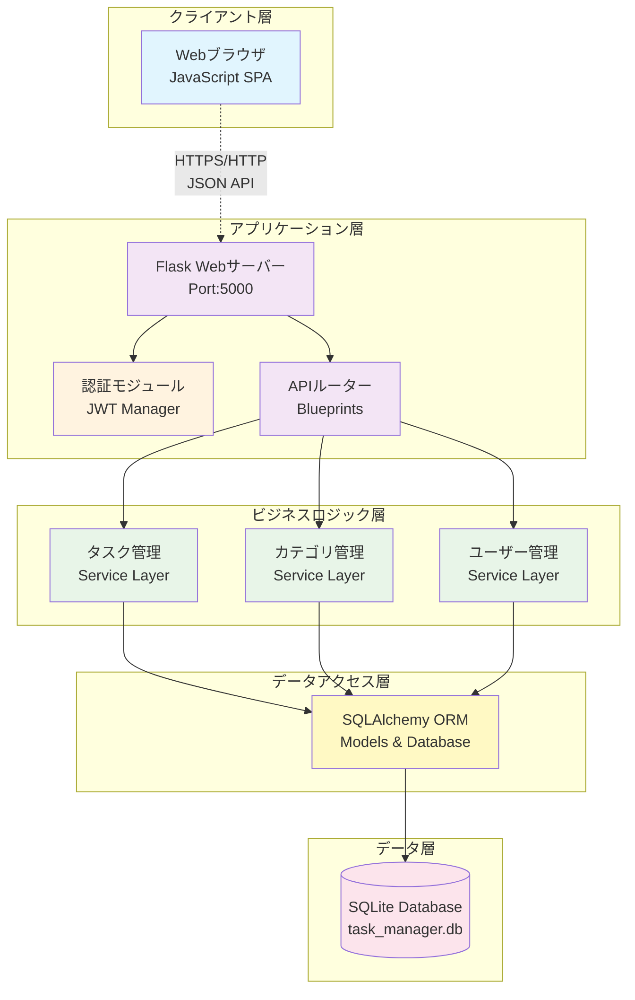
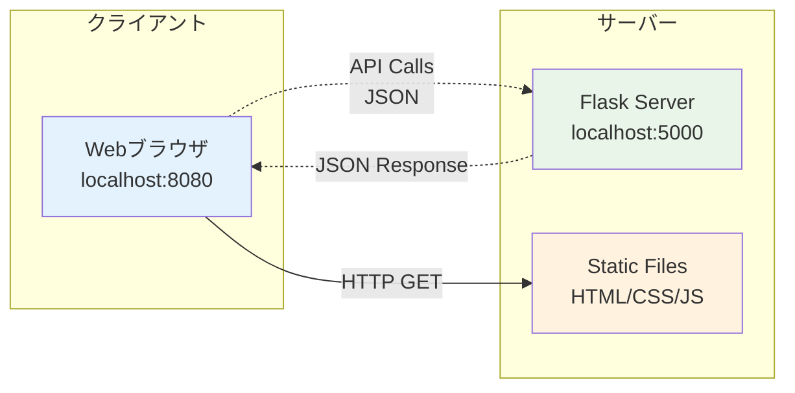
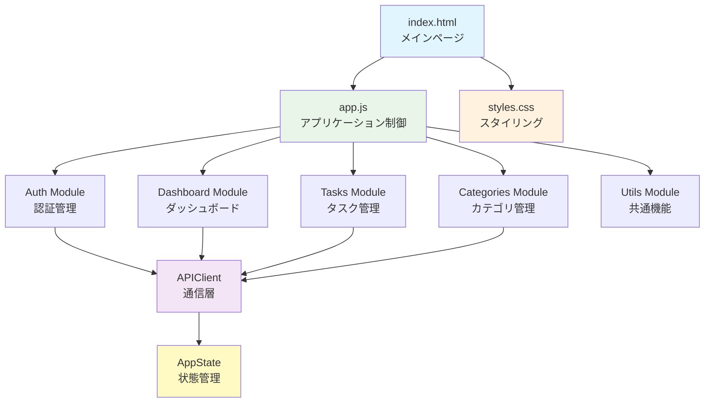
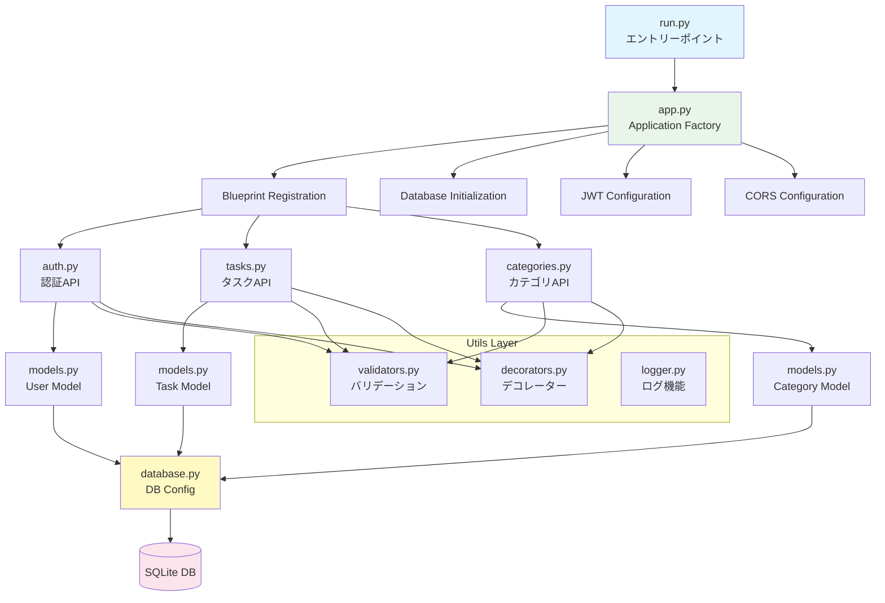
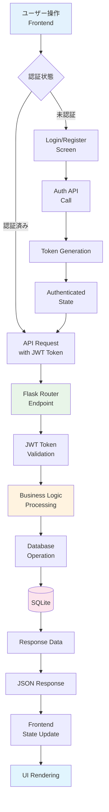
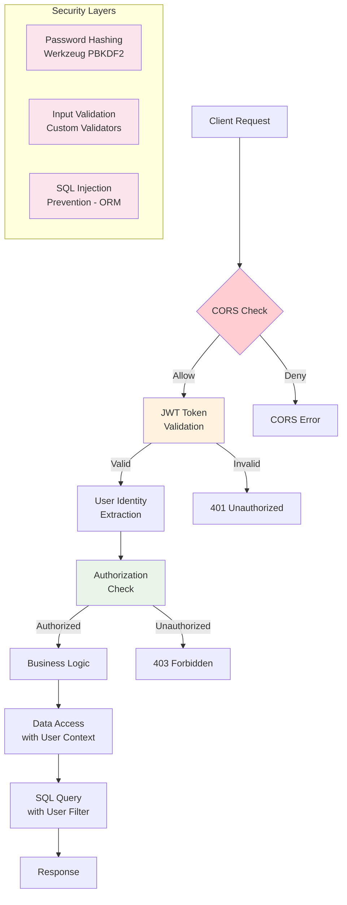
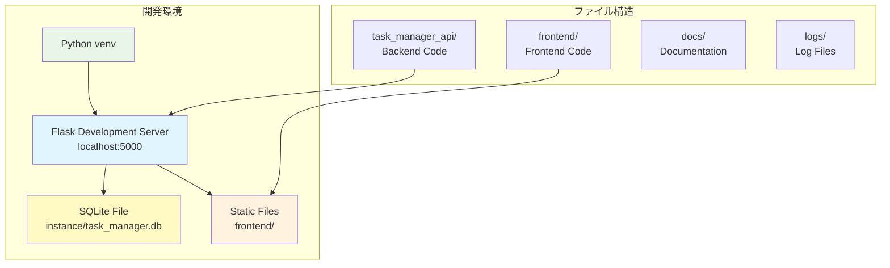
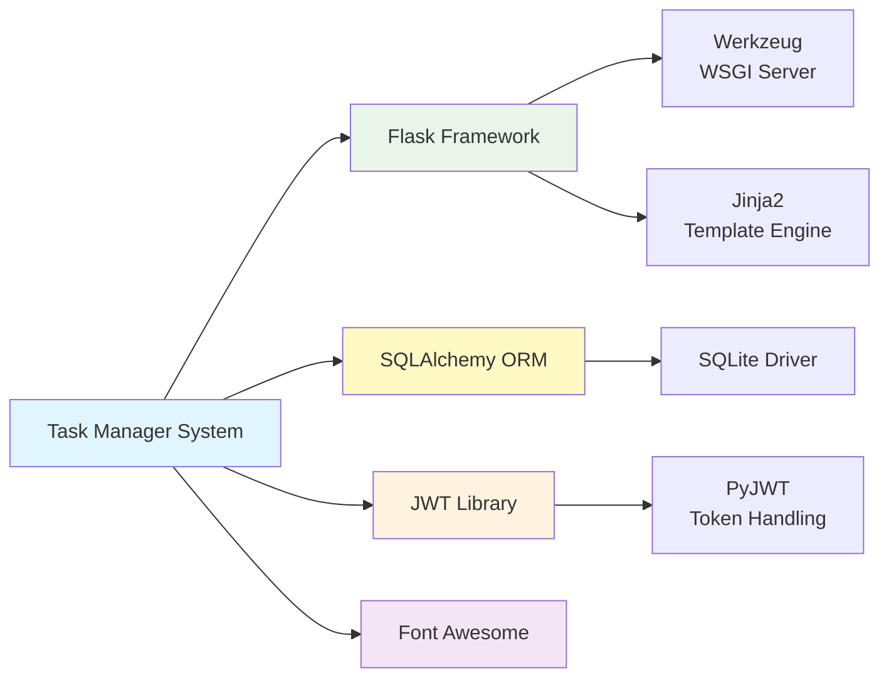

# タスク管理システム - システム構成図

## 1. 全体アーキテクチャ図

## 2. ネットワーク構成図

## 3. フロントエンド構成図

## 4. バックエンド構成図

## 5. データフロー図

## 6. セキュリティアーキテクチャ

## 7. デプロイメント構成

## 8. 外部依存関係

---

**作成日**: 2024年12月27日  
**バージョン**: 1.0  
**次回更新予定**: システム拡張時