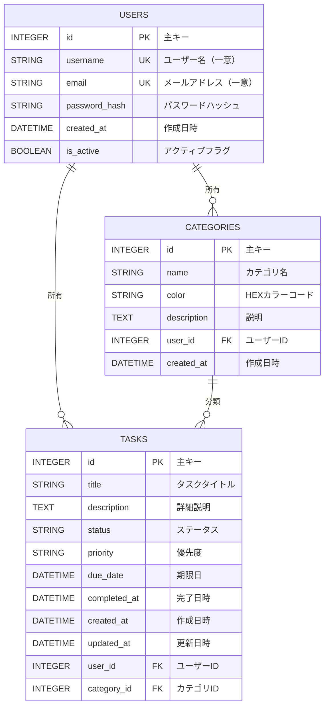
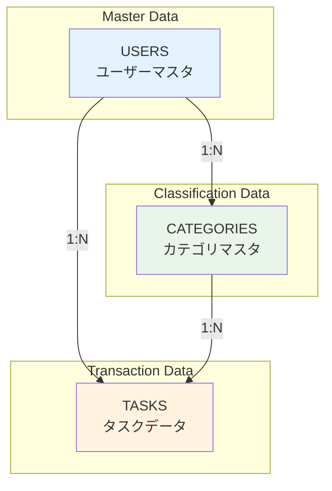

# タスク管理システム - データベース設計書

## 1. データベース概要

### 1.1 DBMS情報
- **データベース管理システム**: SQLite 3
- **ORM**: SQLAlchemy 2.0.43
- **文字エンコード**: UTF-8
- **データベースファイル**: `instance/task_manager.db`

### 1.2 設計方針
- 正規化第3正規形までを適用
- シンプルで保守しやすい構造
- 将来的なPostgreSQL移行を考慮
- 軽量なSQLiteによる開発・検証環境

## 2. ER図（Entity Relationship Diagram）



## 3. テーブル仕様

### 3.1 USERS テーブル

| 項目名 | データ型 | 長さ | NOT NULL | デフォルト値 | 説明 |
|--------|----------|------|----------|--------------|------|
| id | INTEGER | - | ✓ | AUTO | 主キー（自動採番） |
| username | VARCHAR | 80 | ✓ | - | ユーザー名（一意制約） |
| email | VARCHAR | 120 | ✓ | - | メールアドレス（一意制約） |
| password_hash | VARCHAR | 128 | ✓ | - | PBKDF2ハッシュ化パスワード |
| created_at | DATETIME | - | ✓ | CURRENT_TIMESTAMP | アカウント作成日時 |
| is_active | BOOLEAN | - | ✓ | TRUE | アカウント有効フラグ |

**制約条件**:
- PRIMARY KEY: id
- UNIQUE: username, email
- INDEX: username, email

### 3.2 CATEGORIES テーブル

| 項目名 | データ型 | 長さ | NOT NULL | デフォルト値 | 説明 |
|--------|----------|------|----------|--------------|------|
| id | INTEGER | - | ✓ | AUTO | 主キー（自動採番） |
| name | VARCHAR | 50 | ✓ | - | カテゴリ名 |
| color | VARCHAR | 7 | ✓ | #007bff | HEXカラーコード |
| description | TEXT | - | ✗ | - | カテゴリ説明 |
| user_id | INTEGER | - | ✓ | - | 所有者ID（外部キー） |
| created_at | DATETIME | - | ✓ | CURRENT_TIMESTAMP | 作成日時 |

**制約条件**:
- PRIMARY KEY: id
- FOREIGN KEY: user_id → users.id
- UNIQUE: (name, user_id) 同一ユーザー内でカテゴリ名重複不可
- INDEX: user_id, name

### 3.3 TASKS テーブル

| 項目名 | データ型 | 長さ | NOT NULL | デフォルト値 | 説明 |
|--------|----------|------|----------|--------------|------|
| id | INTEGER | - | ✓ | AUTO | 主キー（自動採番） |
| title | VARCHAR | 200 | ✓ | - | タスクタイトル |
| description | TEXT | - | ✗ | - | 詳細説明 |
| status | VARCHAR | 20 | ✓ | pending | ステータス（enum） |
| priority | VARCHAR | 10 | ✓ | medium | 優先度（enum） |
| due_date | DATETIME | - | ✗ | - | 期限日時 |
| completed_at | DATETIME | - | ✗ | - | 完了日時 |
| created_at | DATETIME | - | ✓ | CURRENT_TIMESTAMP | 作成日時 |
| updated_at | DATETIME | - | ✓ | CURRENT_TIMESTAMP | 更新日時 |
| user_id | INTEGER | - | ✓ | - | 所有者ID（外部キー） |
| category_id | INTEGER | - | ✗ | - | カテゴリID（外部キー） |

**制約条件**:
- PRIMARY KEY: id
- FOREIGN KEY: user_id → users.id
- FOREIGN KEY: category_id → categories.id
- INDEX: user_id, status, priority, due_date
- CHECK: status IN ('pending', 'in_progress', 'completed', 'cancelled')
- CHECK: priority IN ('low', 'medium', 'high', 'urgent')

## 4. データベース関係図



## 5. インデックス設計

### 5.1 パフォーマンス向上のためのインデックス

```sql
-- ユーザーテーブル
CREATE INDEX idx_users_username ON users(username);
CREATE INDEX idx_users_email ON users(email);

-- カテゴリテーブル
CREATE INDEX idx_categories_user_id ON categories(user_id);
CREATE INDEX idx_categories_name_user ON categories(name, user_id);

-- タスクテーブル
CREATE INDEX idx_tasks_user_id ON tasks(user_id);
CREATE INDEX idx_tasks_status ON tasks(status);
CREATE INDEX idx_tasks_priority ON tasks(priority);
CREATE INDEX idx_tasks_due_date ON tasks(due_date);
CREATE INDEX idx_tasks_category_id ON tasks(category_id);
CREATE INDEX idx_tasks_user_status ON tasks(user_id, status);
CREATE INDEX idx_tasks_created_at ON tasks(created_at DESC);
```

## 6. データベース初期化

### 6.1 テーブル作成順序
1. USERS（独立テーブル）
2. CATEGORIES（USERSに依存）
3. TASKS（USERS、CATEGORIESに依存）

### 6.2 初期データ

```sql
-- デモユーザー
INSERT INTO users (username, email, password_hash, created_at, is_active) 
VALUES ('demo_user', 'demo@example.com', 'hashed_password', CURRENT_TIMESTAMP, TRUE);

-- デフォルトカテゴリ
INSERT INTO categories (name, color, description, user_id, created_at) VALUES
('仕事', '#007bff', '業務関連のタスク', 1, CURRENT_TIMESTAMP),
('個人', '#28a745', 'プライベートなタスク', 1, CURRENT_TIMESTAMP),
('勉強', '#fd7e14', '学習関連のタスク', 1, CURRENT_TIMESTAMP),
('緊急', '#dc3545', '緊急度の高いタスク', 1, CURRENT_TIMESTAMP);
```

## 7. データ型詳細設計

### 7.1 列挙型（ENUM）の定義

#### ステータス（status）
```python
STATUS_CHOICES = [
    'pending',      # 未完了
    'in_progress',  # 進行中
    'completed',    # 完了済み
    'cancelled'     # キャンセル
]
```

#### 優先度（priority）
```python
PRIORITY_CHOICES = [
    'low',     # 低
    'medium',  # 中
    'high',    # 高
    'urgent'   # 緊急
]
```

### 7.2 カラーコード仕様
- 形式: HEX（#RRGGBB）
- 例: #007bff, #28a745, #dc3545
- 検証: 正規表現 `^#[0-9A-Fa-f]{6}$`

## 8. データ整合性

### 8.1 参照整合性
- user_id: CASCADE DELETE（ユーザー削除時に関連データも削除）
- category_id: SET NULL（カテゴリ削除時はNULLに設定）

### 8.2 ビジネスルール
- ユーザーは自分のデータのみアクセス可能
- カテゴリ名はユーザー内で一意
- 完了タスクは completed_at が自動設定
- タスクのステータス変更履歴は updated_at で追跡

## 9. データベースサイズ見積もり

### 9.1 容量見積もり（1ユーザーあたり）

| テーブル | レコード数 | 1レコードサイズ | 推定サイズ |
|----------|------------|----------------|------------|
| USERS | 1 | 200 bytes | 200 bytes |
| CATEGORIES | 10 | 150 bytes | 1.5 KB |
| TASKS | 1,000 | 500 bytes | 500 KB |
| **合計** | - | - | **約 502 KB** |

### 9.2 インデックスサイズ
- 各インデックス: 約10-20KB
- 全インデックス合計: 約100KB

### 9.3 10ユーザーでの推定サイズ
- データ: 5 MB
- インデックス: 1 MB
- **総サイズ**: 約 6 MB

## 10. バックアップ・復旧

### 10.1 バックアップ戦略
```bash
# SQLiteファイルのバックアップ
cp instance/task_manager.db backups/task_manager_$(date +%Y%m%d_%H%M%S).db

# SQL ダンプ作成
sqlite3 instance/task_manager.db .dump > backups/backup_$(date +%Y%m%d).sql
```

### 10.2 復旧手順
```bash
# ファイル復旧
cp backups/task_manager_YYYYMMDD_HHMMSS.db instance/task_manager.db

# SQL復旧
sqlite3 instance/task_manager.db < backups/backup_YYYYMMDD.sql
```

## 11. パフォーマンス考慮事項

### 11.1 クエリ最適化
- 必要なカラムのみ選択
- 適切なWHERE条件でレコード絞り込み
- JOINの最小化

### 11.2 推奨クエリパターン

```python
# 良い例: ユーザーの未完了タスク取得
Task.query.filter_by(user_id=user_id, status='pending').all()

# 良い例: カテゴリ別タスク統計
db.session.query(Category.name, db.func.count(Task.id))
    .join(Task, Category.id == Task.category_id)
    .filter(Category.user_id == user_id)
    .group_by(Category.name).all()
```

## 12. マイグレーション計画

### 12.1 今後のスキーマ変更対応
```python
# マイグレーション例: タスクにタグ機能追加
def upgrade():
    # タグテーブル追加
    op.create_table('tags',
        sa.Column('id', sa.Integer(), primary_key=True),
        sa.Column('name', sa.String(30), nullable=False),
        sa.Column('color', sa.String(7), default='#6c757d'),
        sa.Column('user_id', sa.Integer(), nullable=False),
        sa.ForeignKeyConstraint(['user_id'], ['users.id'])
    )
    
    # タスク-タグ関連テーブル追加
    op.create_table('task_tags',
        sa.Column('task_id', sa.Integer(), nullable=False),
        sa.Column('tag_id', sa.Integer(), nullable=False),
        sa.ForeignKeyConstraint(['task_id'], ['tasks.id']),
        sa.ForeignKeyConstraint(['tag_id'], ['tags.id']),
        sa.PrimaryKeyConstraint('task_id', 'tag_id')
    )
```

## 13. セキュリティ設計

### 13.1 データアクセス制御
```python
# 行レベルセキュリティ（アプリケーションレベル）
def get_user_tasks(user_id):
    return Task.query.filter_by(user_id=user_id).all()

def get_user_categories(user_id):
    return Category.query.filter_by(user_id=user_id).all()
```

### 13.2 パスワードセキュリティ
```python
# Werkzeugによるパスワードハッシュ化
from werkzeug.security import generate_password_hash, check_password_hash

def set_password(self, password):
    self.password_hash = generate_password_hash(password, method='pbkdf2:sha256')

def check_password(self, password):
    return check_password_hash(self.password_hash, password)
```

## 14. データベース操作例

### 14.1 基本的なCRUD操作

```python
# CREATE: 新規タスク作成
task = Task(
    title="重要なタスク",
    description="詳細な説明",
    priority="high",
    status="pending",
    user_id=1,
    category_id=2
)
db.session.add(task)
db.session.commit()

# READ: ユーザーのタスク一覧取得
tasks = Task.query.filter_by(user_id=1).order_by(Task.created_at.desc()).all()

# UPDATE: タスクステータス更新
task = Task.query.get(1)
task.status = 'completed'
task.completed_at = datetime.utcnow()
task.updated_at = datetime.utcnow()
db.session.commit()

# DELETE: タスク削除
task = Task.query.get(1)
db.session.delete(task)
db.session.commit()
```

### 14.2 複雑なクエリ例

```python
# カテゴリ別タスク統計
stats = db.session.query(
    Category.name,
    Category.color,
    db.func.count(Task.id).label('task_count'),
    db.func.count(db.case([(Task.status == 'completed', Task.id)])).label('completed_count')
).outerjoin(Task, Category.id == Task.category_id)\
 .filter(Category.user_id == user_id)\
 .group_by(Category.id, Category.name, Category.color)\
 .all()

# 期限切れタスク取得
overdue_tasks = Task.query.filter(
    Task.user_id == user_id,
    Task.status.in_(['pending', 'in_progress']),
    Task.due_date < datetime.utcnow()
).order_by(Task.due_date.asc()).all()

# 月別タスク完了数
monthly_completion = db.session.query(
    db.func.strftime('%Y-%m', Task.completed_at).label('month'),
    db.func.count(Task.id).label('completed_count')
).filter(
    Task.user_id == user_id,
    Task.status == 'completed',
    Task.completed_at >= datetime.now() - timedelta(days=365)
).group_by(db.func.strftime('%Y-%m', Task.completed_at)).all()
```

## 15. データベースメンテナンス

### 15.1 定期メンテナンス作業

```sql
-- データベース最適化
VACUUM;

-- 統計情報更新
ANALYZE;

-- インデックス再構築
REINDEX;
```

### 15.2 ディスク使用量確認

```sql
-- テーブルサイズ確認
SELECT 
    name,
    SUM("pgsize") as size_bytes,
    ROUND(SUM("pgsize") / 1024.0 / 1024.0, 2) as size_mb
FROM "dbstat" 
WHERE name IN ('users', 'categories', 'tasks')
GROUP BY name;
```

## 16. 制限事項と改善点

### 16.1 現在の制限事項
- SQLiteによるマルチユーザー同時書き込み制限
- 全文検索機能の不足
- レプリケーション機能なし
- 大量データ処理に不向き

### 16.2 将来の改善案
- PostgreSQL移行によるスケーラビリティ向上
- 全文検索インデックス（FTS5）の導入
- パーティショニング対応
- 読み取り専用レプリカの追加

---

**作成日**: 2024年12月27日  
**バージョン**: 1.0  
**次回レビュー**: システム拡張時