# タスク管理システム - シーケンス図

## 1. ユーザー認証フロー

### 1.1 ユーザー登録シーケンス

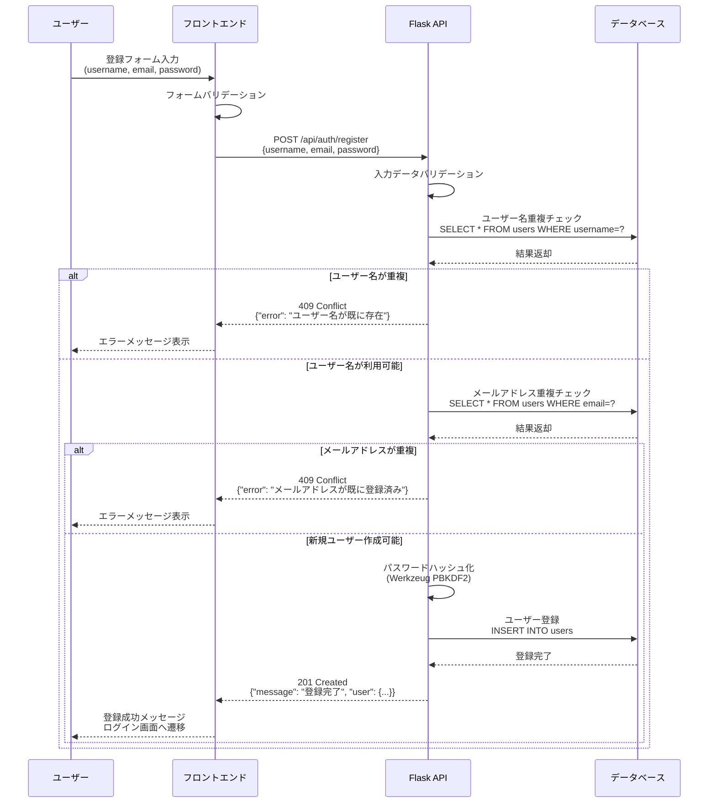

### 1.2 ログインシーケンス

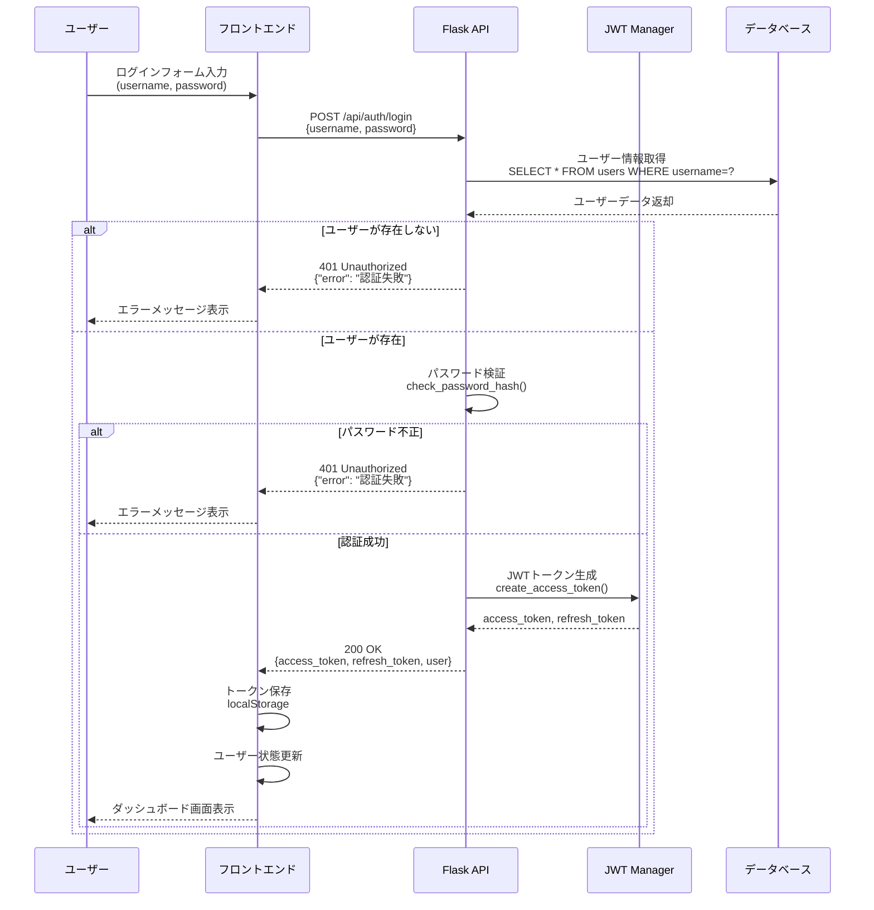

## 2. タスク管理フロー

### 2.1 タスク作成シーケンス

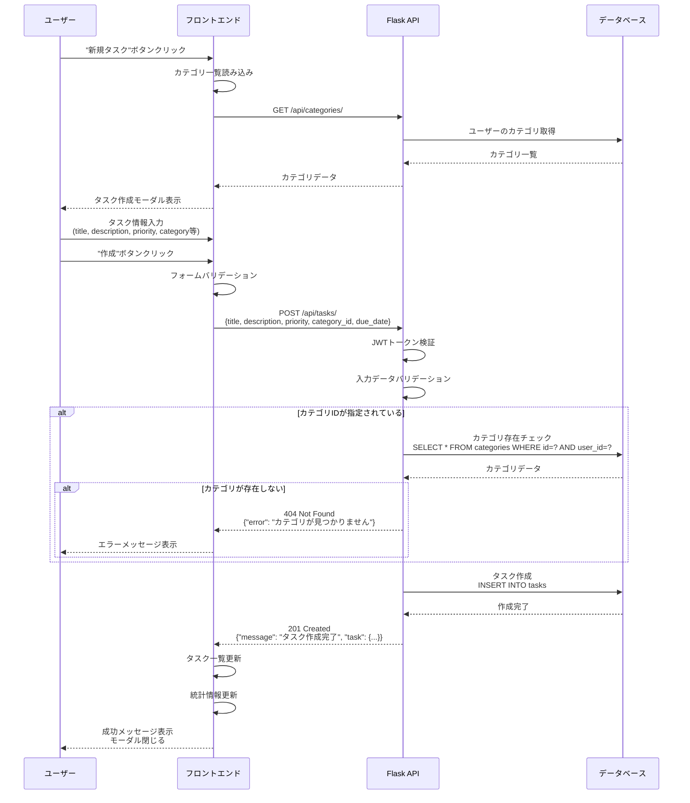

### 2.2 タスク更新シーケンス

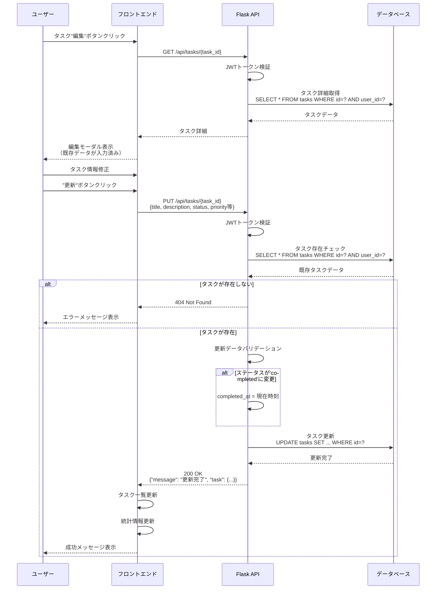

## 3. カテゴリ管理フロー

### 3.1 カテゴリ作成シーケンス

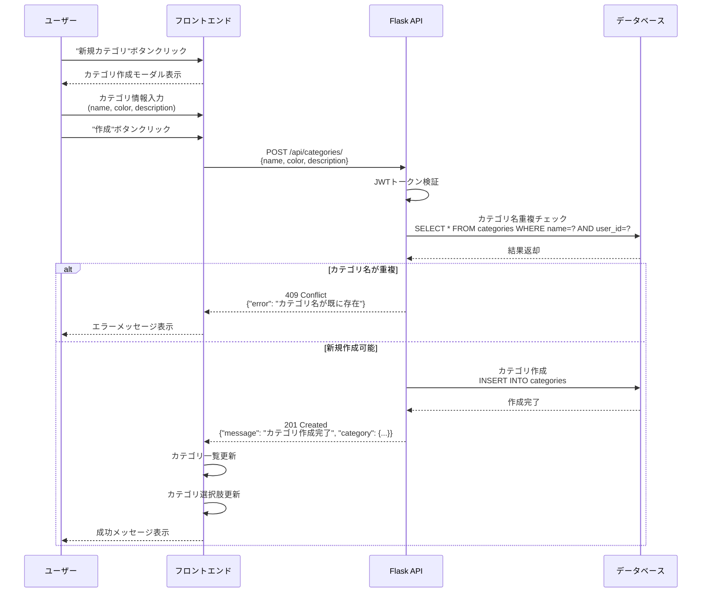

## 4. ダッシュボード読み込みフロー

### 4.1 ダッシュボード初期化シーケンス

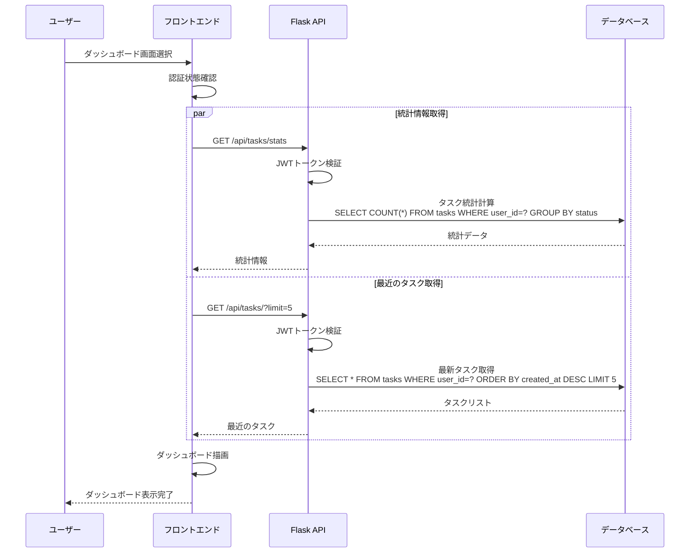

## 5. エラーハンドリングフロー

### 5.1 認証エラー処理シーケンス

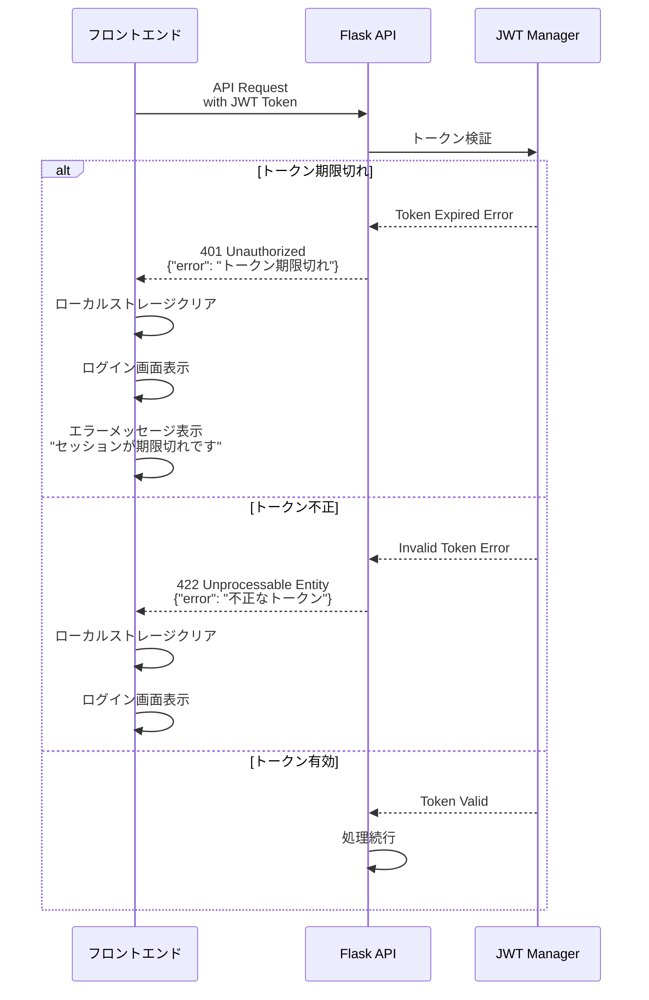

### 5.2 データベースエラー処理シーケンス

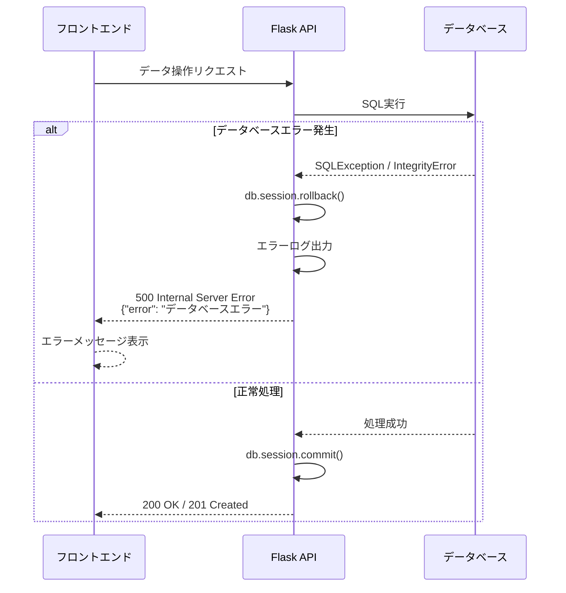

## 6. タスクフィルタリングフロー

### 6.1 フィルタ適用シーケンス

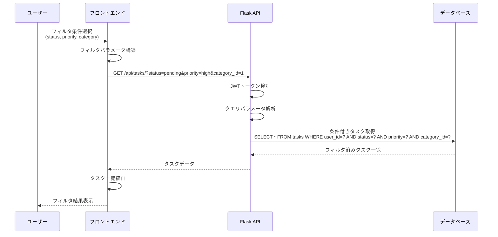

## 7. カテゴリ削除フロー

### 7.1 カテゴリ削除シーケンス

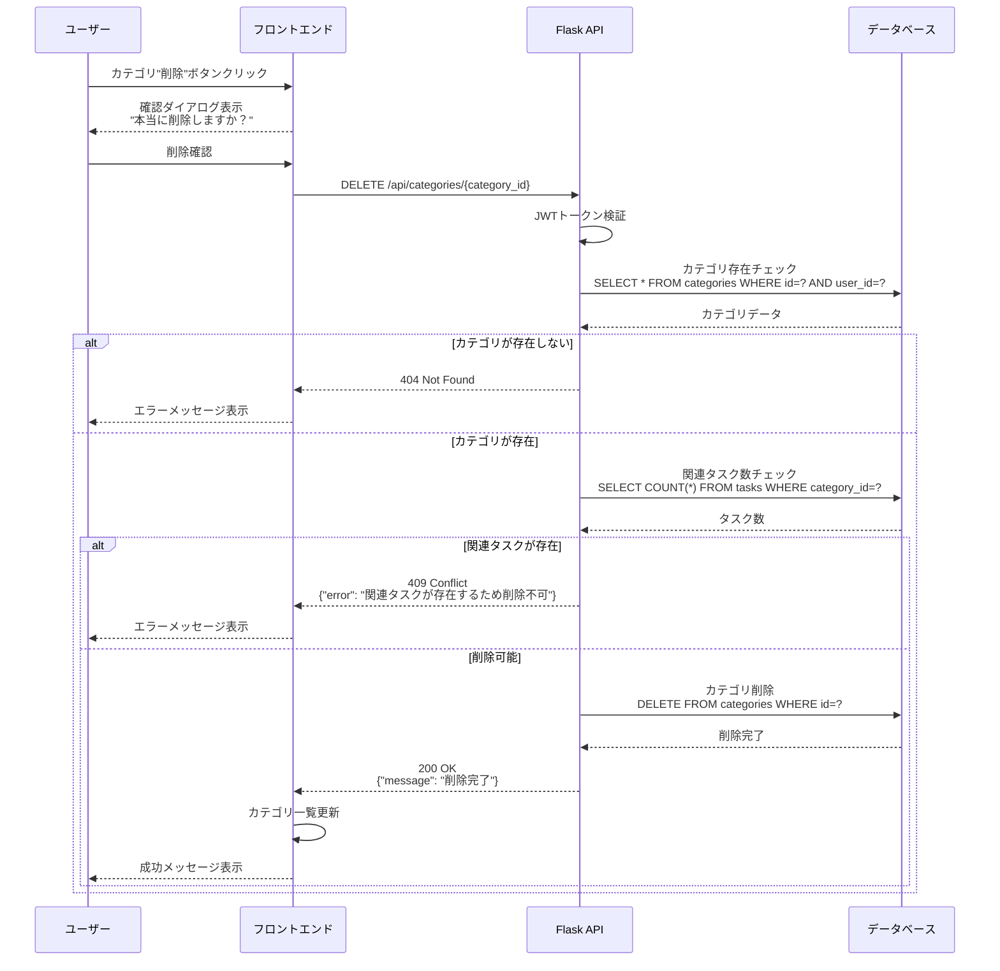

## 8. アプリケーション初期化フロー

### 8.1 アプリケーション起動シーケンス

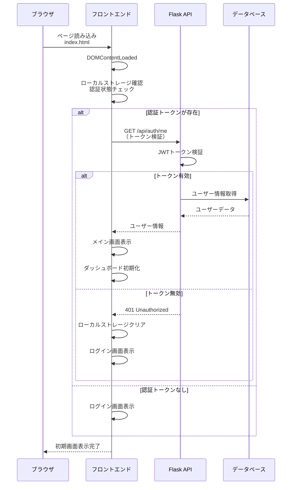

## 9. データ同期フロー

### 9.1 リアルタイム更新シーケンス

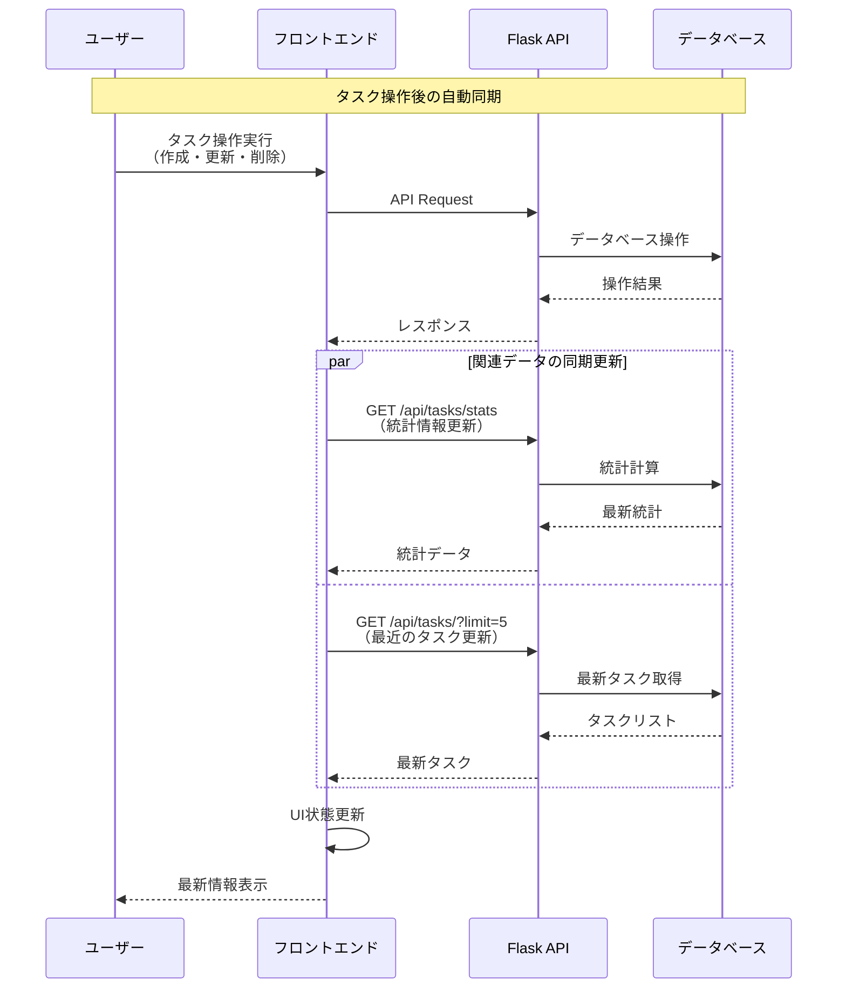

## 10. エラー復旧フロー

### 10.1 ネットワークエラー処理

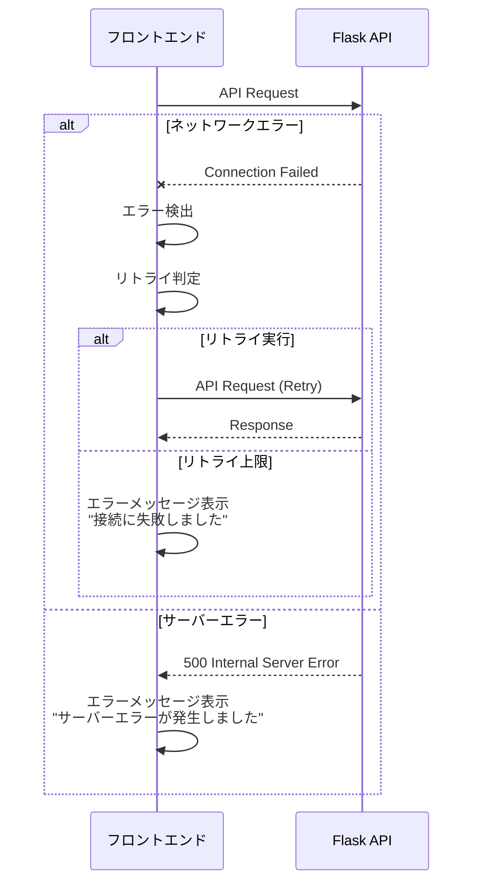

---

**作成日**: 2024年12月27日  
**バージョン**: 1.0  
**対象システム**: Personal Task Manager v1.0