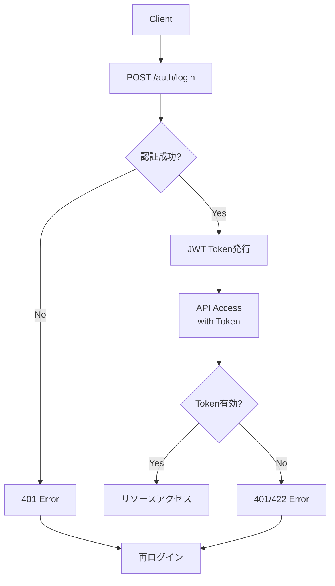

# タスク管理システム - API設計書

## 1. API概要

### 1.1 設計方針
- **RESTful API**: リソース指向の設計
- **JSON形式**: リクエスト・レスポンスはJSON
- **JWT認証**: ステートレスな認証方式
- **統一されたエラーレスポンス**: 一貫性のあるエラー処理

### 1.2 ベース情報
- **ベースURL**: `http://localhost:5000/api`
- **認証方式**: Bearer Token (JWT)
- **文字エンコード**: UTF-8
- **Content-Type**: `application/json`

## 2. 認証・認可

### 2.1 認証ヘッダー
```http
Authorization: Bearer <access_token>
```

### 2.2 認証フロー図



## 3. エンドポイント一覧

### 3.1 エンドポイント概要

| カテゴリ | エンドポイント | メソッド | 認証 | 説明 |
|----------|----------------|----------|------|------|
| 認証 | `/auth/register` | POST | ❌ | ユーザー登録 |
| 認証 | `/auth/login` | POST | ❌ | ログイン |
| 認証 | `/auth/refresh` | POST | 🔄 | トークン更新 |
| 認証 | `/auth/me` | GET | ✅ | 現在ユーザー情報 |
| タスク | `/tasks/` | GET | ✅ | タスク一覧取得 |
| タスク | `/tasks/` | POST | ✅ | タスク作成 |
| タスク | `/tasks/{id}` | GET | ✅ | タスク詳細取得 |
| タスク | `/tasks/{id}` | PUT | ✅ | タスク更新 |
| タスク | `/tasks/{id}` | DELETE | ✅ | タスク削除 |
| タスク | `/tasks/stats` | GET | ✅ | タスク統計 |
| カテゴリ | `/categories/` | GET | ✅ | カテゴリ一覧 |
| カテゴリ | `/categories/` | POST | ✅ | カテゴリ作成 |
| カテゴリ | `/categories/{id}` | PUT | ✅ | カテゴリ更新 |
| カテゴリ | `/categories/{id}` | DELETE | ✅ | カテゴリ削除 |
| カテゴリ | `/categories/{id}/tasks` | GET | ✅ | カテゴリ別タスク |

凡例: ✅=JWT必須, 🔄=Refresh Token必須, ❌=認証不要

## 4. 認証API

### 4.1 ユーザー登録

**エンドポイント**: `POST /api/auth/register`

**リクエスト**:
```json
{
  "username": "user123",
  "email": "user@example.com",
  "password": "securepassword"
}
```

**レスポンス**:
```json
{
  "message": "ユーザー登録が完了しました",
  "user": {
    "id": 1,
    "username": "user123",
    "email": "user@example.com",
    "created_at": "2024-01-01T00:00:00.000000",
    "is_active": true
  }
}
```

**バリデーションルール**:
- username: 3-80文字、英数字とアンダースコア
- email: 有効なメールアドレス形式
- password: 8文字以上

### 4.2 ログイン

**エンドポイント**: `POST /api/auth/login`

**リクエスト**:
```json
{
  "username": "user123",
  "password": "securepassword"
}
```

**レスポンス**:
```json
{
  "message": "ログインに成功しました",
  "access_token": "eyJ0eXAiOiJKV1QiLCJhbGciOiJIUzI1NiJ9...",
  "refresh_token": "eyJ0eXAiOiJKV1QiLCJhbGciOiJIUzI1NiJ9...",
  "user": {
    "id": 1,
    "username": "user123",
    "email": "user@example.com",
    "created_at": "2024-01-01T00:00:00.000000",
    "is_active": true
  }
}
```

## 5. タスクAPI

### 5.1 タスク一覧取得

**エンドポイント**: `GET /api/tasks/`

**クエリパラメータ**:
```http
GET /api/tasks/?status=pending&priority=high&category_id=1&limit=10
```

| パラメータ | 型 | 必須 | 説明 | 例 |
|------------|-------|------|------|-----|
| status | string | ❌ | ステータスフィルタ | pending, in_progress, completed, cancelled |
| priority | string | ❌ | 優先度フィルタ | low, medium, high, urgent |
| category_id | integer | ❌ | カテゴリフィルタ | 1, 2, 3 |
| limit | integer | ❌ | 取得件数制限 | 10, 50, 100 |

**レスポンス**:
```json
{
  "tasks": [
    {
      "id": 1,
      "title": "重要なタスク",
      "description": "詳細な説明",
      "status": "pending",
      "priority": "high",
      "due_date": "2024-12-31T23:59:59.000000",
      "completed_at": null,
      "created_at": "2024-01-01T00:00:00.000000",
      "updated_at": "2024-01-01T00:00:00.000000",
      "user_id": 1,
      "category_id": 1,
      "category_name": "仕事"
    }
  ],
  "total": 1
}
```

### 5.2 タスク作成

**エンドポイント**: `POST /api/tasks/`

**リクエスト**:
```json
{
  "title": "新しいタスク",
  "description": "タスクの詳細説明",
  "priority": "high",
  "status": "pending",
  "category_id": 1,
  "due_date": "2024-12-31T23:59:59"
}
```

**必須フィールド**: `title`

**レスポンス**:
```json
{
  "message": "タスクを作成しました",
  "task": {
    "id": 2,
    "title": "新しいタスク",
    "description": "タスクの詳細説明",
    "status": "pending",
    "priority": "high",
    "due_date": "2024-12-31T23:59:59.000000",
    "completed_at": null,
    "created_at": "2024-01-02T10:30:00.000000",
    "updated_at": "2024-01-02T10:30:00.000000",
    "user_id": 1,
    "category_id": 1,
    "category_name": "仕事"
  }
}
```

### 5.3 タスク統計

**エンドポイント**: `GET /api/tasks/stats`

**レスポンス**:
```json
{
  "stats": {
    "total_tasks": 10,
    "pending_tasks": 3,
    "in_progress_tasks": 2,
    "completed_tasks": 5,
    "completion_rate": 50.0,
    "high_priority_tasks": 2,
    "urgent_priority_tasks": 1
  }
}
```

## 6. カテゴリAPI

### 6.1 カテゴリ一覧取得

**エンドポイント**: `GET /api/categories/`

**レスポンス**:
```json
{
  "categories": [
    {
      "id": 1,
      "name": "仕事",
      "color": "#007bff",
      "description": "業務関連のタスク",
      "user_id": 1,
      "created_at": "2024-01-01T00:00:00.000000",
      "task_count": 5
    }
  ]
}
```

### 6.2 カテゴリ作成

**エンドポイント**: `POST /api/categories/`

**リクエスト**:
```json
{
  "name": "新しいカテゴリ",
  "color": "#ff5722",
  "description": "カテゴリの説明"
}
```

**必須フィールド**: `name`

## 7. エラー仕様

### 7.1 エラーレスポンス形式

すべてのエラーは以下の統一形式で返却されます：

```json
{
  "error": "エラーメッセージ"
}
```

### 7.2 HTTPステータスコード

| コード | 説明 | 使用場面 |
|--------|------|----------|
| 200 | OK | 正常な取得・更新 |
| 201 | Created | 正常な作成 |
| 400 | Bad Request | 無効なリクエストデータ |
| 401 | Unauthorized | 認証エラー |
| 403 | Forbidden | 権限エラー |
| 404 | Not Found | リソースが存在しない |
| 409 | Conflict | データ競合（重複など） |
| 422 | Unprocessable Entity | JWT関連エラー |
| 500 | Internal Server Error | サーバー内部エラー |

### 7.3 エラー例

```json
// 400 Bad Request
{
  "error": "タイトルは必須項目です"
}

// 401 Unauthorized
{
  "error": "ユーザー名またはパスワードが正しくありません"
}

// 404 Not Found
{
  "error": "タスクが見つかりません"
}

// 409 Conflict
{
  "error": "このユーザー名は既に使用されています"
}

// 422 Unprocessable Entity
{
  "error": "トークンが無効です"
}
```

## 8. API使用例

### 8.1 JavaScript (フロントエンド)

```javascript
// 認証付きAPI呼び出し
class APIClient {
    static async request(endpoint, options = {}) {
        const url = `${API_BASE_URL}${endpoint}`;
        const token = localStorage.getItem('access_token');
        
        const config = {
            method: 'GET',
            headers: {
                'Content-Type': 'application/json',
                ...(token && { 'Authorization': `Bearer ${token}` })
            },
            ...options
        };
        
        const response = await fetch(url, config);
        const data = await response.json();
        
        if (!response.ok) {
            throw new Error(data.error || `HTTP ${response.status}`);
        }
        
        return data;
    }
}

// タスク作成例
const createTask = async (taskData) => {
    try {
        const response = await APIClient.request('/tasks/', {
            method: 'POST',
            body: JSON.stringify(taskData)
        });
        console.log('タスク作成成功:', response);
    } catch (error) {
        console.error('タスク作成エラー:', error.message);
    }
};
```

### 8.2 Python クライアント

```python
import requests
import json

class TaskManagerClient:
    def __init__(self, base_url="http://localhost:5000/api"):
        self.base_url = base_url
        self.access_token = None
    
    def login(self, username, password):
        """ログイン"""
        response = requests.post(f"{self.base_url}/auth/login", 
                               json={"username": username, "password": password})
        
        if response.status_code == 200:
            data = response.json()
            self.access_token = data['access_token']
            return data['user']
        else:
            raise Exception(response.json()['error'])
    
    def get_headers(self):
        """認証ヘッダー"""
        return {
            'Content-Type': 'application/json',
            'Authorization': f'Bearer {self.access_token}'
        }
    
    def create_task(self, title, description=None, priority='medium', category_id=None):
        """タスク作成"""
        task_data = {
            'title': title,
            'description': description,
            'priority': priority,
            'category_id': category_id
        }
        
        response = requests.post(f"{self.base_url}/tasks/", 
                               json=task_data, 
                               headers=self.get_headers())
        
        if response.status_code == 201:
            return response.json()['task']
        else:
            raise Exception(response.json()['error'])

# 使用例
client = TaskManagerClient()
user = client.login("demo_user", "demo_password")
task = client.create_task("重要なタスク", priority="high")
```

### 8.3 cURL例

```bash
# ユーザー登録
curl -X POST http://localhost:5000/api/auth/register \
  -H "Content-Type: application/json" \
  -d '{"username": "testuser", "email": "test@example.com", "password": "testpass"}'

# ログイン
curl -X POST http://localhost:5000/api/auth/login \
  -H "Content-Type: application/json" \
  -d '{"username": "testuser", "password": "testpass"}'

# タスク作成（トークンは上記ログインで取得）
curl -X POST http://localhost:5000/api/tasks/ \
  -H "Content-Type: application/json" \
  -H "Authorization: Bearer YOUR_TOKEN_HERE" \
  -d '{"title": "新しいタスク", "priority": "medium"}'

# タスク一覧取得（フィルタ付き）
curl -X GET "http://localhost:5000/api/tasks/?status=pending&priority=high" \
  -H "Authorization: Bearer YOUR_TOKEN_HERE"
```

## 9. データバリデーション仕様

### 9.1 ユーザー登録バリデーション

```python
def validate_user_registration(data):
    """ユーザー登録データのバリデーション"""
    errors = []
    
    # ユーザー名チェック
    username = data.get('username', '').strip()
    if not username:
        errors.append('ユーザー名は必須です')
    elif len(username) < 3:
        errors.append('ユーザー名は3文字以上である必要があります')
    elif len(username) > 80:
        errors.append('ユーザー名は80文字以内である必要があります')
    elif not re.match(r'^[a-zA-Z0-9_]+$', username):
        errors.append('ユーザー名は英数字とアンダースコアのみ使用可能です')
    
    # メールアドレスチェック
    email = data.get('email', '').strip()
    if not email:
        errors.append('メールアドレスは必須です')
    elif not re.match(r'^[^\s@]+@[^\s@]+\.[^\s@]+$', email):
        errors.append('有効なメールアドレスを入力してください')
    
    # パスワードチェック
    password = data.get('password', '')
    if not password:
        errors.append('パスワードは必須です')
    elif len(password) < 8:
        errors.append('パスワードは8文字以上である必要があります')
    
    if errors:
        raise ValidationError('; '.join(errors))
    
    return {'username': username, 'email': email, 'password': password}
```

### 9.2 タスクデータバリデーション

```python
def validate_task_data(data):
    """タスクデータのバリデーション"""
    errors = []
    
    # タイトルチェック
    title = data.get('title', '').strip()
    if not title:
        errors.append('タスクタイトルは必須です')
    elif len(title) > 200:
        errors.append('タスクタイトルは200文字以内である必要があります')
    
    # ステータスチェック
    status = data.get('status', 'pending')
    if status not in ['pending', 'in_progress', 'completed', 'cancelled']:
        errors.append('無効なステータスです')
    
    # 優先度チェック
    priority = data.get('priority', 'medium')
    if priority not in ['low', 'medium', 'high', 'urgent']:
        errors.append('無効な優先度です')
    
    if errors:
        raise ValidationError('; '.join(errors))
    
    return {'title': title}
```

## 10. レート制限・パフォーマンス

### 10.1 レスポンス時間目標

| エンドポイント | 目標レスポンス時間 |
|----------------|-------------------|
| GET /tasks/ | < 100ms |
| POST /tasks/ | < 200ms |
| PUT /tasks/{id} | < 150ms |
| DELETE /tasks/{id} | < 100ms |
| GET /tasks/stats | < 300ms |

### 10.2 ページネーション

```http
GET /api/tasks/?page=1&per_page=20
```

**レスポンス**:
```json
{
  "tasks": [...],
  "pagination": {
    "page": 1,
    "per_page": 20,
    "total": 100,
    "pages": 5,
    "has_prev": false,
    "has_next": true,
    "prev_num": null,
    "next_num": 2
  }
}
```

## 11. API テスト仕様

### 11.1 単体テスト例

```python
def test_create_task_success():
    """タスク作成成功テスト"""
    # テストユーザーでログイン
    login_response = client.post('/api/auth/login', 
                               json={'username': 'test_user', 'password': 'test_pass'})
    token = login_response.json['access_token']
    
    # タスク作成
    task_data = {
        'title': 'テストタスク',
        'priority': 'high'
    }
    response = client.post('/api/tasks/', 
                         json=task_data,
                         headers={'Authorization': f'Bearer {token}'})
    
    assert response.status_code == 201
    assert response.json['message'] == 'タスクを作成しました'
    assert response.json['task']['title'] == 'テストタスク'

def test_create_task_unauthorized():
    """認証なしタスク作成テスト"""
    task_data = {'title': 'テストタスク'}
    response = client.post('/api/tasks/', json=task_data)
    
    assert response.status_code == 401
```

### 11.2 統合テスト例

```python
def test_task_lifecycle():
    """タスクのライフサイクルテスト"""
    # 1. ログイン
    login_response = client.post('/api/auth/login', 
                               json={'username': 'test_user', 'password': 'test_pass'})
    token = login_response.json['access_token']
    headers = {'Authorization': f'Bearer {token}'}
    
    # 2. タスク作成
    create_response = client.post('/api/tasks/', 
                                json={'title': 'ライフサイクルテスト'},
                                headers=headers)
    task_id = create_response.json['task']['id']
    
    # 3. タスク更新
    update_response = client.put(f'/api/tasks/{task_id}', 
                               json={'status': 'completed'},
                               headers=headers)
    
    # 4. タスク削除
    delete_response = client.delete(f'/api/tasks/{task_id}', headers=headers)
    
    # 検証
    assert create_response.status_code == 201
    assert update_response.status_code == 200
    assert delete_response.status_code == 200
```

## 12. セキュリティ考慮事項

### 12.1 認証・認可
- JWT トークンの適切な有効期限設定
- refresh token による安全なトークン更新
- ユーザーは自分のリソースのみアクセス可能

### 12.2 入力検証
- 全入力データのサニタイズ
- SQLインジェクション対策（SQLAlchemy ORM使用）
- XSS対策（エスケープ処理）

### 12.3 CORS設定
```python
CORS(app, origins=[
    "http://localhost:8080", 
    "http://127.0.0.1:8080", 
    "file://"
])
```

## 13. APIバージョン管理

### 13.1 バージョニング戦略
- **現在**: v1（URLパスなし）
- **将来**: `/api/v2/` のようなURLパス

### 13.2 後方互換性
- 新しいフィールド追加時は既存APIに影響しない
- 非推奨フィールドは段階的に削除
- API変更時は事前通知

---

**作成日**: 2024年12月27日  
**バージョン**: 1.0  
**API バージョン**: v1