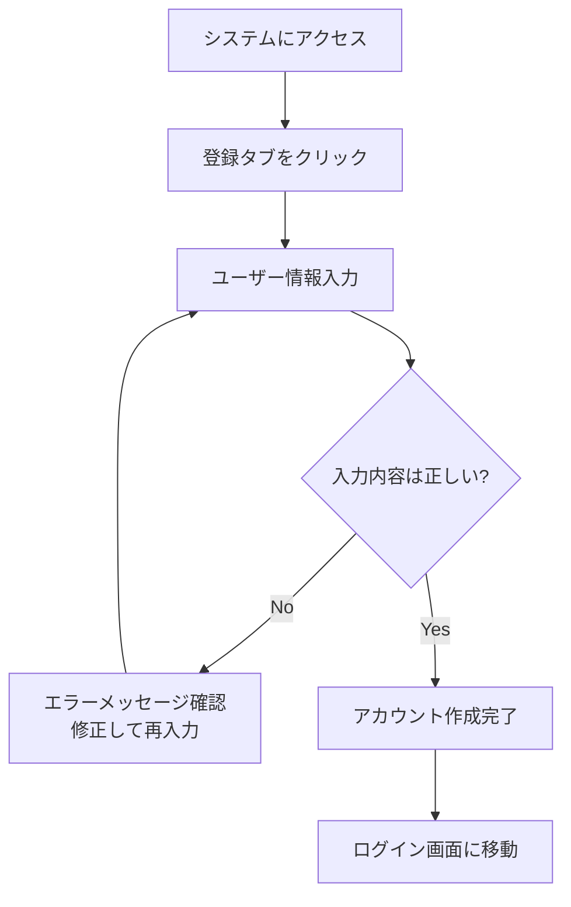

# タスク管理システム - ユーザーマニュアル

## 📚 目次

1. [はじめに](#1-はじめに)
2. [システム要件](#2-システム要件)
3. [アカウント作成・ログイン](#3-アカウント作成ログイン)
4. [ダッシュボード](#4-ダッシュボード)
5. [タスク管理](#5-タスク管理)
6. [カテゴリ管理](#6-カテゴリ管理)
7. [設定・カスタマイズ](#7-設定カスタマイズ)
8. [トラブルシューティング](#8-トラブルシューティング)

---

## 1. はじめに

### 1.1 システムについて
Personal Task Managerは、個人のタスク管理を効率化するWebアプリケーションです。タスクの作成、分類、進捗管理を直感的に行うことができます。

### 1.2 主な機能
- ✅ タスクの作成・編集・削除
- 🏷️ カテゴリによるタスク分類
- 📊 進捗状況の可視化
- 🎯 優先度・期限の管理
- 🌙 ダークモード対応

### 1.3 対象ユーザー
- 個人でタスク管理を行いたい方
- プロジェクト管理の基本ツールが必要な方
- シンプルで使いやすいツールをお探しの方

---

## 2. システム要件

### 2.1 対応ブラウザ
- Chrome 90+
- Firefox 88+
- Safari 14+
- Edge 90+

### 2.2 画面解像度
- デスクトップ: 1024×768以上推奨
- タブレット: 768×1024対応
- スマートフォン: 375×667対応

### 2.3 インターネット接続
- 常時接続が必要（オフライン機能なし）

---

## 3. アカウント作成・ログイン

### 3.1 新規アカウント作成



**手順**:
1. ブラウザで `http://localhost:8080` にアクセス
2. 「新規登録」タブをクリック
3. 以下の情報を入力：
   - **ユーザー名**: 3-80文字（英数字・アンダースコア）
   - **メールアドレス**: 有効なメールアドレス
   - **パスワード**: 8文字以上
4. 「登録」ボタンをクリック
5. 成功メッセージが表示されたら、ログイン画面でログイン

### 3.2 ログイン

**手順**:
1. 「ログイン」タブをクリック（デフォルト）
2. ユーザー名とパスワードを入力
3. 「ログイン」ボタンをクリック
4. 成功するとダッシュボード画面に移動

**デモアカウント**:
- ユーザー名: `demo_user`
- パスワード: `demo_password`

---

## 4. ダッシュボード

### 4.1 ダッシュボード概要

ダッシュボードは、タスクの全体状況を一目で把握できる画面です。

**表示内容**:
- 📊 **統計情報**
  - 総タスク数
  - 未完了タスク数
  - 完了済みタスク数
  - 完了率
- 📋 **最近のタスク**（直近5件）

### 4.2 統計情報の見方

| 項目 | 説明 |
|------|------|
| 総タスク数 | 作成したタスクの総数 |
| 未完了タスク | 「未完了」「進行中」ステータスのタスク |
| 完了済みタスク | 「完了済み」ステータスのタスク |
| 完了率 | (完了済みタスク ÷ 総タスク数) × 100 |

---

## 5. タスク管理

### 5.1 タスク一覧画面

**画面の見方**:
- 📋 タスクカード表示
- 🏷️ カテゴリ別の色分け
- 🎯 優先度・ステータスバッジ
- 📅 期限日表示

### 5.2 新規タスク作成

**手順**:
1. 「タスク」メニューを選択
2. 「+ 新規タスク」ボタンをクリック
3. タスク情報を入力：

| 項目 | 必須 | 説明 |
|------|------|------|
| タスクタイトル | ✅ | タスクの名前（200文字以内） |
| 説明 | ❌ | 詳細な説明 |
| 優先度 | ❌ | 低・中・高・緊急（デフォルト：中） |
| ステータス | ❌ | 未完了・進行中・完了済み・キャンセル |
| カテゴリ | ❌ | 事前に作成したカテゴリから選択 |
| 期限日 | ❌ | 日時指定 |

4. 「作成」ボタンをクリック

### 5.3 タスク編集

**手順**:
1. 編集したいタスクの「📝」ボタンをクリック
2. 必要な項目を修正
3. 「更新」ボタンをクリック

**ヒント**:
- ステータスを「完了済み」に変更すると、完了日時が自動設定されます
- 期限日は空白にすることで削除できます

### 5.4 タスク削除

**手順**:
1. 削除したいタスクの「🗑️」ボタンをクリック
2. 確認ダイアログで「OK」をクリック

⚠️ **注意**: 削除したタスクは復元できません。

### 5.5 タスクフィルタリング

**フィルタ機能**:
- **ステータス**: 全て / 未完了 / 進行中 / 完了済み / キャンセル
- **優先度**: 全て / 低 / 中 / 高 / 緊急
- **カテゴリ**: 全て / 個別カテゴリ

**手順**:
1. タスク一覧画面上部のフィルタを選択
2. 「フィルタ適用」ボタンをクリック
3. 条件に合うタスクのみ表示

---

## 6. カテゴリ管理

### 6.1 カテゴリとは

タスクを種類別に分類するためのラベルです。色分けにより視覚的に識別できます。

**デフォルトカテゴリ**:
- 🔵 **仕事**: 業務関連のタスク
- 🟢 **個人**: プライベートなタスク
- 🟠 **勉強**: 学習関連のタスク
- 🔴 **緊急**: 緊急度の高いタスク

### 6.2 新規カテゴリ作成

**手順**:
1. 「カテゴリ」メニューを選択
2. 「+ 新規カテゴリ」ボタンをクリック
3. カテゴリ情報を入力：

| 項目 | 必須 | 説明 |
|------|------|------|
| カテゴリ名 | ✅ | カテゴリの名前（50文字以内） |
| 色 | ❌ | HEXカラーコード（例: #ff5722） |
| 説明 | ❌ | カテゴリの用途説明 |

4. 「作成」ボタンをクリック

### 6.3 カテゴリ編集・削除

**編集手順**:
1. 編集したいカテゴリの「📝」ボタンをクリック
2. 必要な項目を修正
3. 「更新」ボタンをクリック

**削除手順**:
1. 削除したいカテゴリの「🗑️」ボタンをクリック
2. 確認ダイアログで「OK」をクリック

⚠️ **注意**: 関連するタスクがある場合、カテゴリは削除できません。

---

## 7. 設定・カスタマイズ

### 7.1 テーマ切り替え

**ダークモード / ライトモード**:
1. 画面右上の「🌙」または「☀️」ボタンをクリック
2. テーマが即座に切り替わります
3. 設定はブラウザに保存されます

### 7.2 ブラウザ設定

**おすすめ設定**:
- JavaScript有効化（必須）
- ローカルストレージ有効化（必須）
- ポップアップブロック無効化（通知用）

---

## 8. トラブルシューティング

### 8.1 よくある問題と解決方法

#### 🔸 ログインできない

**症状**: ユーザー名・パスワードを入力してもログインできない

**解決方法**:
1. ユーザー名・パスワードの大文字小文字を確認
2. 空白文字が入っていないか確認
3. デモアカウント（`demo_user` / `demo_password`）で試行
4. ブラウザのキャッシュをクリア

#### 🔸 タスクが表示されない

**症状**: タスク一覧画面が空白または読み込まれない

**解決方法**:
1. ページを更新（F5キー）
2. フィルタ設定を「全て」に変更
3. ブラウザのネットワークタブでエラー確認
4. サーバーが起動しているか確認

#### 🔸 データが保存されない

**症状**: タスクやカテゴリを作成しても保存されない

**解決方法**:
1. 必須項目（タイトルなど）が入力されているか確認
2. 特殊文字の使用を避ける
3. ブラウザのJavaScriptが有効か確認
4. エラーメッセージを確認

#### 🔸 画面表示が崩れる

**症状**: レイアウトが正しく表示されない

**解決方法**:
1. ブラウザキャッシュをクリア
2. 対応ブラウザを使用
3. ズーム設定を100%に変更
4. CSS読み込みエラーがないか確認

### 8.2 エラーメッセージ一覧

| エラーメッセージ | 原因 | 対処法 |
|------------------|------|--------|
| "セッションが期限切れです" | JWTトークン期限切れ | 再ログインしてください |
| "ユーザー名またはパスワードが正しくありません" | 認証情報不正 | 正しい情報を入力してください |
| "このユーザー名は既に使用されています" | ユーザー名重複 | 別のユーザー名を選択してください |
| "タスクタイトルは必須項目です" | 必須項目未入力 | タイトルを入力してください |
| "関連タスクが存在するため削除できません" | カテゴリに関連タスクあり | 関連タスクを削除または移動してください |

### 8.3 システム要件確認

**ブラウザでの確認方法**:
1. ブラウザの開発者ツールを開く（F12キー）
2. Consoleタブでエラーメッセージを確認
3. Networkタブで通信状況を確認

**サーバー確認方法**:
```bash
# サーバー起動状況確認
curl http://localhost:5000/health

# 期待されるレスポンス
{
  "status": "OK", 
  "message": "タスク管理API は正常に動作中です",
  "version": "1.0.0"
}
```

---

## 9. 効果的な使用方法

### 9.1 タスク管理のベストプラクティス

#### 📝 タスク作成のコツ
- **具体的なタイトル**: 「メール返信」より「田中さんにプロジェクト進捗メール返信」
- **適切な優先度設定**: 緊急度と重要度を考慮
- **現実的な期限設定**: 余裕を持った期限設定
- **詳細な説明**: 後で見返した時に理解できる説明

#### 🏷️ カテゴリ活用法
- **色分けルール**: 緊急度やプロジェクト別に色を統一
- **階層化**: 「仕事-営業」「仕事-開発」のような命名
- **定期見直し**: 使わなくなったカテゴリは削除

#### 📊 進捗管理のポイント
- **毎日の確認**: ダッシュボードで全体状況をチェック
- **定期的な整理**: 完了済みタスクの整理
- **優先度見直し**: 状況変化に応じた優先度調整

### 9.2 ワークフロー例

#### 🌅 朝のルーティン
1. ダッシュボードで全体状況確認
2. 今日取り組むタスクをチェック
3. 優先度の見直し・調整

#### 🌆 夕方のルーティン
1. 完了したタスクのステータス更新
2. 翌日のタスク確認
3. 新しいタスクの追加

#### 📅 週次レビュー
1. 完了率の確認
2. 期限切れタスクの整理
3. カテゴリの見直し

---

## 10. ショートカット・便利機能

### 10.1 キーボードショートカット

| 操作 | ショートカット | 説明 |
|------|----------------|------|
| タスク作成 | `Ctrl + N` | 新規タスクモーダルを開く |
| 検索 | `Ctrl + F` | ブラウザ検索（タスク内検索） |
| 更新 | `F5` | ページ更新 |
| ダークモード切替 | `Ctrl + Shift + D` | テーマ切替 |

### 10.2 モバイル対応機能

**タッチ操作**:
- **スワイプ**: 左右スワイプでカテゴリ切替
- **長押し**: タスクカードの長押しで編集メニュー
- **ピンチ**: ズームイン・アウト対応

**レスポンシブ機能**:
- ハンバーガーメニュー（モバイル）
- 折りたたみ可能なサイドバー
- タッチフレンドリーなボタンサイズ

---

## 11. データのエクスポート・インポート

### 11.1 データのバックアップ

現在、GUIからのエクスポート機能はありませんが、管理者により以下の方法でバックアップ可能です：

```bash
# データベースのバックアップ
cp instance/task_manager.db backup_$(date +%Y%m%d).db

# SQLダンプ作成
sqlite3 instance/task_manager.db .dump > backup_$(date +%Y%m%d).sql
```

### 11.2 将来の拡張機能

**予定している機能**:
- CSV エクスポート
- JSON エクスポート  
- インポート機能
- 他システム連携

---

## 12. 制限事項・注意事項

### 12.1 現在の制限事項

- **オフライン使用**: インターネット接続が必要
- **同時編集**: 複数デバイスでの同時編集は非対応
- **ファイル添付**: タスクへのファイル添付は未対応
- **通知機能**: プッシュ通知は未対応

### 12.2 ブラウザ固有の注意事項

**Safari**:
- ローカルストレージが無効の場合、設定で有効化が必要

**Chrome**:
- CORS設定により`file://`での動作に制限あり

**Firefox**:
- プライベートモードでは一部機能が制限される場合があります

---

## 13. サポート・フィードバック

### 13.1 問題の報告

システムに問題がある場合は、以下の情報をお知らせください：

- 使用ブラウザとバージョン
- エラーメッセージの内容
- 操作手順の詳細
- スクリーンショット（可能であれば）

### 13.2 機能要望

新しい機能のご要望やシステム改善のご提案をお待ちしています：

- 使いづらい箇所
- 欲しい機能
- UIの改善案
- パフォーマンスの問題

---

## 14. システム更新・メンテナンス

### 14.1 定期メンテナンス

システムは以下のタイミングで更新される場合があります：

- **セキュリティアップデート**: 随時
- **機能追加**: 月次
- **バグ修正**: 週次

### 14.2 データ保護

**自動バックアップ**:
現在は手動バックアップのみ対応

**データ保持期間**:
- アクティブユーザー: 無期限
- 非アクティブユーザー: 1年間（予定）

---

**📄 マニュアル作成日**: 2024年12月27日  
**📋 システムバージョン**: 1.0  
**📞 サポート**: システム管理者までお問い合わせください