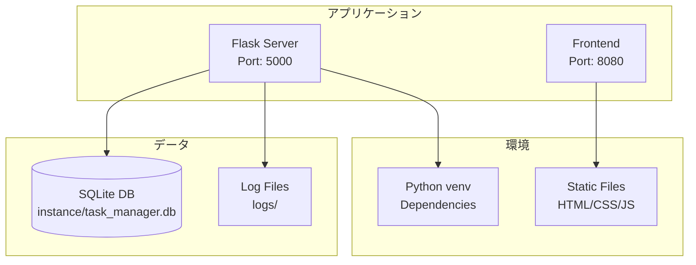
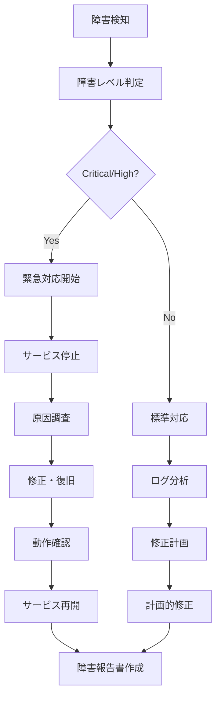

# タスク管理システム - 運用保守マニュアル

## 📋 目次

1. [システム運用概要](#1-システム運用概要)
2. [環境構築・デプロイ](#2-環境構築デプロイ)
3. [日常運用手順](#3-日常運用手順)
4. [監視・ログ管理](#4-監視ログ管理)
5. [バックアップ・復旧](#5-バックアップ復旧)
6. [トラブルシューティング](#6-トラブルシューティング)
7. [メンテナンス作業](#7-メンテナンス作業)

---

## 1. システム運用概要

### 1.1 運用体制
- **開発環境**: 開発者による管理
- **運用時間**: 24時間（開発・検証目的）
- **監視レベル**: 基本監視（ログ確認）

### 1.2 システム構成


---

## 2. 環境構築・デプロイ

### 2.1 初回環境構築

```bash
# 1. リポジトリクローン
git clone <repository_url>
cd task-manager

# 2. Python仮想環境作成
python -m venv venv
source venv/bin/activate  # Linux/Mac
# または
venv\Scripts\activate     # Windows

# 3. 依存関係インストール
pip install -r requirements.txt

# 4. データベース初期化
cd task_manager_api
python run.py

# 5. フロントエンド起動
cd ../frontend
python -m http.server 8080
```

### 2.2 自動起動スクリプト

**Linux/Mac**:
```bash
#!/bin/bash
# start_app.sh

echo "タスク管理システムを起動します..."

# Python仮想環境アクティベート
source venv/bin/activate

# バックエンド起動（バックグラウンド）
cd task_manager_api
python run.py &
BACKEND_PID=$!

# フロントエンド起動（バックグラウンド）
cd ../frontend
python -m http.server 8080 &
FRONTEND_PID=$!

echo "Backend PID: $BACKEND_PID"
echo "Frontend PID: $FRONTEND_PID"
echo "システムが起動しました！"
echo "Frontend: http://localhost:8080"
echo "Backend API: http://localhost:5000"
echo ""
echo "終了するには Ctrl+C を押してください"

# 終了シグナル処理
trap 'kill $BACKEND_PID $FRONTEND_PID; exit' INT
wait
```

**Windows**:
```batch
@echo off
REM start_app.bat

echo タスク管理システムを起動します...

REM Python仮想環境アクティベート
call venv\Scripts\activate

REM バックエンド起動
cd task_manager_api
start /B python run.py

REM フロントエンド起動
cd ..\frontend
start /B python -m http.server 8080

echo システムが起動しました！
echo Frontend: http://localhost:8080
echo Backend API: http://localhost:5000
echo.
echo 終了するには任意のキーを押してください
pause
```

---

## 3. 日常運用手順

### 3.1 サーバー起動・停止

**起動手順**:
```bash
# 1. 仮想環境アクティベート
source venv/bin/activate

# 2. バックエンド起動
cd task_manager_api
python run.py &

# 3. フロントエンド起動
cd ../frontend
python -m http.server 8080 &
```

**停止手順**:
```bash
# プロセス確認
ps aux | grep python

# プロセス停止
kill <PID>

# または一括停止
pkill -f "python run.py"
pkill -f "http.server"
```

### 3.2 ヘルスチェック

**システム状態確認**:
```bash
# バックエンドAPI確認
curl http://localhost:5000/health

# 期待されるレスポンス
{
  "status": "OK",
  "message": "タスク管理API は正常に動作中です", 
  "version": "1.0.0"
}

# フロントエンド確認
curl -I http://localhost:8080

# 期待されるレスポンス
HTTP/1.0 200 OK
```

---

## 4. 監視・ログ管理

### 4.1 ログファイル構成

```
logs/
├── task_manager.log     # アプリケーションログ
├── errors.log          # エラーログ
└── access.log          # アクセスログ（将来実装）
```

### 4.2 ログ確認コマンド

```bash
# 最新ログ確認
tail -f logs/task_manager.log

# エラーログ確認
tail -n 50 logs/errors.log

# 特定期間のログ検索
grep "2024-12-27" logs/task_manager.log

# エラー件数集計
grep -c "ERROR" logs/errors.log
```

### 4.3 ログローテーション

**設定例** (`/etc/logrotate.d/task-manager`):
```bash
/path/to/task-manager/logs/*.log {
    daily
    rotate 30
    compress
    delaycompress
    missingok
    notifempty
    create 644 www-data www-data
}
```

---

## 5. バックアップ・復旧

### 5.1 バックアップ戦略

#### 📊 バックアップスケジュール
- **日次**: データベース自動バックアップ
- **週次**: 完全システムバックアップ
- **月次**: 長期保存用アーカイブ

#### 💾 バックアップスクリプト

```bash
#!/bin/bash
# backup.sh

DATE=$(date +%Y%m%d_%H%M%S)
BACKUP_DIR="backups"

# バックアップディレクトリ作成
mkdir -p $BACKUP_DIR

# データベースバックアップ
echo "データベースをバックアップしています..."
cp instance/task_manager.db $BACKUP_DIR/task_manager_$DATE.db

# SQLダンプ作成
sqlite3 instance/task_manager.db .dump > $BACKUP_DIR/dump_$DATE.sql

# ログバックアップ
tar -czf $BACKUP_DIR/logs_$DATE.tar.gz logs/

# 古いバックアップ削除（30日以上）
find $BACKUP_DIR -name "*.db" -mtime +30 -delete
find $BACKUP_DIR -name "*.sql" -mtime +30 -delete
find $BACKUP_DIR -name "*.tar.gz" -mtime +30 -delete

echo "バックアップ完了: $BACKUP_DIR/"
```

### 5.2 復旧手順

#### 🔄 データベース復旧

```bash
# 1. サービス停止
pkill -f "python run.py"

# 2. 現在のDBをバックアップ
cp instance/task_manager.db instance/task_manager_backup_$(date +%Y%m%d).db

# 3. バックアップから復旧
cp backups/task_manager_YYYYMMDD_HHMMSS.db instance/task_manager.db

# 4. 権限設定
chmod 644 instance/task_manager.db

# 5. サービス再開
python run.py
```

#### 📥 SQLダンプからの復旧

```bash
# 1. 新しいデータベース作成
rm instance/task_manager.db

# 2. SQLダンプから復元
sqlite3 instance/task_manager.db < backups/dump_YYYYMMDD.sql

# 3. データベース整合性チェック
sqlite3 instance/task_manager.db "PRAGMA integrity_check;"
```

---

## 6. トラブルシューティング

### 6.1 一般的な問題

#### 🔸 サーバーが起動しない

**症状**: `python run.py` でエラーが発生

**確認事項**:
```bash
# Python環境確認
python --version
pip list

# ポート使用状況確認
netstat -tulpn | grep 5000
lsof -i :5000

# エラーログ確認
cat logs/errors.log
```

**解決方法**:
```bash
# 1. 依存関係再インストール
pip install -r requirements.txt

# 2. ポート変更（必要に応じて）
export FLASK_RUN_PORT=5001

# 3. データベース再初期化
rm instance/task_manager.db
python run.py
```

#### 🔸 データベースエラー

**症状**: `sqlite3.OperationalError` が発生

**確認事項**:
```bash
# データベースファイル確認
ls -la instance/task_manager.db

# データベース整合性チェック
sqlite3 instance/task_manager.db "PRAGMA integrity_check;"

# テーブル構造確認
sqlite3 instance/task_manager.db ".schema"
```

**解決方法**:
```bash
# 1. データベース修復
sqlite3 instance/task_manager.db "VACUUM;"

# 2. バックアップから復旧
cp backups/latest_backup.db instance/task_manager.db

# 3. 初期化（最終手段）
rm instance/task_manager.db
python run.py
```

### 6.2 パフォーマンス問題

#### 📈 レスポンス速度改善

```sql
-- インデックス確認
.indices

-- 実行計画確認
EXPLAIN QUERY PLAN SELECT * FROM tasks WHERE user_id = 1;

-- データベース最適化
VACUUM;
ANALYZE;
```

#### 💾 ディスク使用量確認

```bash
# データベースサイズ確認
du -h instance/task_manager.db

# ログサイズ確認
du -h logs/

# システム全体サイズ
du -sh .
```

---

## 7. メンテナンス作業

### 7.1 定期メンテナンス

#### 📅 日次作業
- [ ] システム稼働確認
- [ ] エラーログチェック
- [ ] ディスク使用量確認

#### 📅 週次作業
- [ ] データベース最適化実行
- [ ] 古いログファイル整理
- [ ] パフォーマンス確認

#### 📅 月次作業
- [ ] 完全バックアップ実行
- [ ] セキュリティアップデート確認
- [ ] システム利用状況分析

### 7.2 メンテナンススクリプト

```bash
#!/bin/bash
# maintenance.sh

echo "メンテナンス作業を開始します..."

# 1. データベース最適化
echo "データベースを最適化しています..."
sqlite3 instance/task_manager.db "VACUUM; ANALYZE;"

# 2. ログローテーション
echo "ログをローテーションしています..."
logrotate -f logrotate.conf

# 3. 古いファイル削除
echo "古いファイルを削除しています..."
find logs/ -name "*.log.*" -mtime +30 -delete
find backups/ -name "*.db" -mtime +30 -delete

# 4. ディスク使用量チェック
echo "ディスク使用量:"
du -sh .
df -h .

echo "メンテナンス作業が完了しました"
```

### 7.3 アップデート手順

```bash
# 1. バックアップ作成
./backup.sh

# 2. サービス停止
pkill -f "python run.py"
pkill -f "http.server"

# 3. コード更新
git pull origin main

# 4. 依存関係更新
pip install -r requirements.txt

# 5. データベースマイグレーション（必要に応じて）
python -c "from app.database import db; db.create_all()"

# 6. サービス再開
./start_app.sh

# 7. 動作確認
curl http://localhost:5000/health
```

---

## 8. セキュリティ運用

### 8.1 セキュリティチェックリスト

#### 🔒 認証・認可
- [ ] JWTトークンの有効期限適切性
- [ ] パスワードハッシュ化の確認
- [ ] 不正アクセス試行の監視

#### 🛡️ データ保護
- [ ] データベースファイルの権限確認
- [ ] バックアップファイルの暗号化
- [ ] ログファイルの機密情報除去

### 8.2 セキュリティ監視

```bash
# 失敗したログイン試行の確認
grep "認証失敗" logs/task_manager.log | tail -10

# 異常なアクセスパターン確認  
grep "401\|403\|422" logs/task_manager.log | head -20

# データベースアクセスエラー確認
grep "Database\|SQL" logs/errors.log
```

---

## 9. 性能監視

### 9.1 パフォーマンス指標

| 指標 | 目標値 | 確認方法 |
|------|--------|----------|
| レスポンス時間 | < 200ms | ログ分析 |
| データベースサイズ | < 100MB | `du -h` |
| メモリ使用量 | < 512MB | `ps` コマンド |
| CPU使用率 | < 50% | `top` コマンド |

### 9.2 監視コマンド

```bash
# プロセス監視
ps aux | grep python

# メモリ・CPU使用量
top -p $(pgrep -f "python run.py")

# ディスク使用量
df -h /path/to/task-manager

# ネットワーク接続
netstat -tulpn | grep 5000
```

---

## 10. 障害対応

### 10.1 障害レベル定義

| レベル | 説明 | 対応時間 | 対応者 |
|--------|------|----------|--------|
| **Critical** | システム完全停止 | 即座 | 開発者 |
| **High** | 主要機能停止 | 1時間以内 | 開発者 |
| **Medium** | 一部機能異常 | 4時間以内 | 運用者 |
| **Low** | 軽微な問題 | 24時間以内 | 運用者 |

### 10.2 障害対応フロー



### 10.3 緊急対応手順

```bash
# 1. 現状確認
curl http://localhost:5000/health
ps aux | grep python

# 2. ログ確認
tail -n 100 logs/errors.log
tail -n 100 logs/task_manager.log

# 3. サービス再起動
pkill -f "python run.py"
python run.py

# 4. 動作確認
curl -X POST http://localhost:5000/api/auth/login \
  -H "Content-Type: application/json" \
  -d '{"username": "demo_user", "password": "demo_password"}'
```

---

## 11. 容量管理

### 11.1 ディスク使用量監視

```bash
#!/bin/bash
# disk_check.sh

THRESHOLD=80  # 使用率80%で警告

USAGE=$(df -h . | awk 'NR==2 {print $5}' | sed 's/%//')

if [ $USAGE -gt $THRESHOLD ]; then
    echo "警告: ディスク使用率が ${USAGE}% です"
    echo "データベースサイズ: $(du -h instance/task_manager.db)"
    echo "ログサイズ: $(du -h logs/)"
fi
```

### 11.2 容量削減対策

```bash
# 古いログ削除
find logs/ -name "*.log.*" -mtime +7 -delete

# データベース最適化
sqlite3 instance/task_manager.db "VACUUM;"

# 完了済み古いタスク削除（90日以上前）
sqlite3 instance/task_manager.db "
DELETE FROM tasks 
WHERE status = 'completed' 
AND completed_at < datetime('now', '-90 days');
"
```

---

## 12. システム更新

### 12.1 更新種別

| 種別 | 内容 | 頻度 | ダウンタイム |
|------|------|------|--------------|
| **パッチ** | バグ修正 | 随時 | なし |
| **マイナー** | 機能追加 | 月次 | < 5分 |
| **メジャー** | 大幅変更 | 四半期 | < 30分 |

### 12.2 更新手順テンプレート

```bash
#!/bin/bash
# update.sh

VERSION=$1
if [ -z "$VERSION" ]; then
    echo "使用法: $0 <version>"
    exit 1
fi

echo "システムを v$VERSION に更新します..."

# 1. バックアップ作成
./backup.sh

# 2. サービス停止
pkill -f "python run.py"

# 3. コード更新
git fetch
git checkout v$VERSION

# 4. 依存関係更新
pip install -r requirements.txt

# 5. データベースマイグレーション
python migrate.py

# 6. サービス開始
./start_app.sh

# 7. 動作確認
sleep 5
curl http://localhost:5000/health

echo "更新完了: v$VERSION"
```

---

## 13. 開発者向け情報

### 13.1 開発環境セットアップ

```bash
# 開発用追加パッケージ
pip install pytest pytest-cov black flake8

# テスト実行
pytest tests/ -v --cov=app

# コード品質チェック
flake8 app/
black app/ --check
```

### 13.2 デバッグ情報

```python
# デバッグモード有効化
export FLASK_DEBUG=1
export FLASK_ENV=development

# SQLクエリログ有効化
import logging
logging.basicConfig()
logging.getLogger('sqlalchemy.engine').setLevel(logging.INFO)
```

---

## 14. チェックリスト

### 14.1 日次チェックリスト

- [ ] システム稼働状況確認
- [ ] エラーログチェック
- [ ] ディスク使用量確認
- [ ] レスポンス時間確認

### 14.2 週次チェックリスト

- [ ] データベース最適化実行
- [ ] バックアップ完了確認
- [ ] ログローテーション実行
- [ ] セキュリティログ確認

### 14.3 月次チェックリスト

- [ ] 完全バックアップ実行
- [ ] システム利用統計作成
- [ ] セキュリティアップデート確認
- [ ] パフォーマンス分析レポート作成

---

**作成日**: 2024年12月27日  
**バージョン**: 1.0  
**更新頻度**: システム変更時