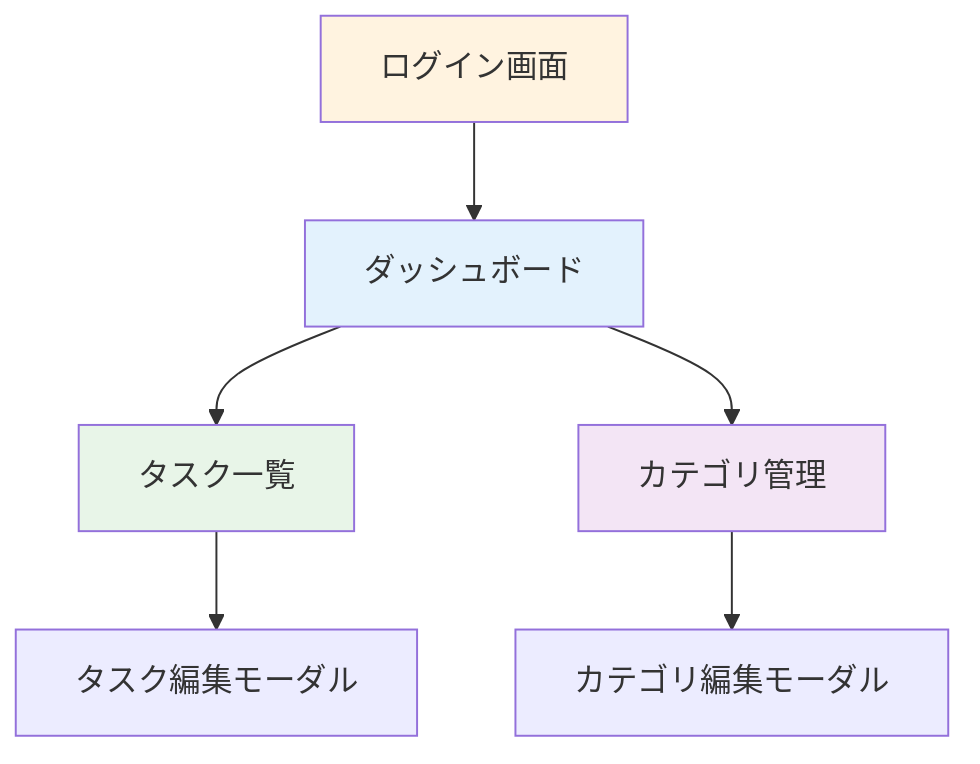
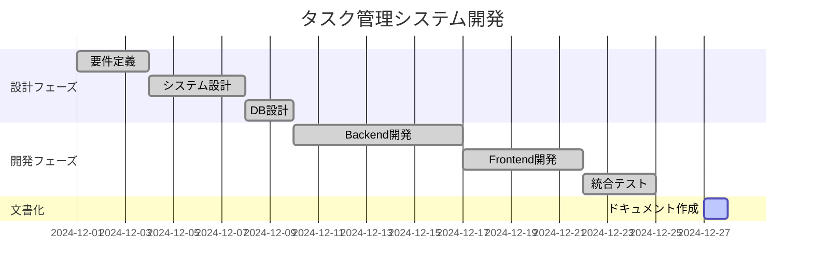

# 📋 Personal Task Manager
## システム説明資料

**開発チーム**: Background Agent  
**作成日**: 2024年12月27日  
**バージョン**: 1.0

---

## 📚 目次

1. **システム概要**
2. **主要機能**
3. **技術アーキテクチャ**
4. **データベース設計**
5. **API設計**
6. **ユーザーインターフェース**
7. **セキュリティ対策**
8. **運用・保守**

---

## 1. システム概要

### 🎯 目的
個人のタスク管理を効率化し、生産性向上を支援

### 👥 対象ユーザー
- 個人でタスク管理を行いたいユーザー
- シンプルなツールを求めるユーザー
- プロジェクト管理の基本機能が必要なユーザー

### ✨ 特徴
- **直感的**: 分かりやすいUI/UX
- **軽量**: SQLiteによる簡単デプロイ
- **安全**: JWT認証によるセキュア設計

---

## 2. 主要機能

### 📋 タスク管理
- ✅ **CRUD操作**: 作成・閲覧・更新・削除
- 🎯 **優先度設定**: 低・中・高・緊急
- 📊 **ステータス管理**: 未完了・進行中・完了・キャンセル
- 📅 **期限管理**: 期限日時の設定・表示

### 🏷️ カテゴリ管理
- 🎨 **色分け機能**: 視覚的な分類
- 📁 **グループ化**: 関連タスクの整理
- 📊 **統計表示**: カテゴリ別タスク数

---

## 3. 技術アーキテクチャ

### 🏗️ システム構成

```
┌─────────────────┐    HTTP/JSON    ┌─────────────────┐
│  フロントエンド   │ ◄──────────────► │   バックエンド    │
│ JavaScript SPA   │                 │   Flask API     │
│ (Port: 8080)     │                 │ (Port: 5000)    │
└─────────────────┘                 └─────────────────┘
                                             │
                                     SQLAlchemy ORM
                                             │
                                    ┌─────────────────┐
                                    │   SQLite DB     │
                                    │ task_manager.db │
                                    └─────────────────┘
```

---

## 4. 技術スタック

### 🔧 バックエンド
- **Flask** 3.0.0 - Webフレームワーク
- **SQLAlchemy** 2.0+ - ORM
- **SQLite** 3 - データベース
- **Flask-JWT-Extended** - 認証
- **Flask-CORS** - CORS対応

### 🎨 フロントエンド
- **Pure JavaScript** - ES6+
- **CSS3** - レスポンシブデザイン
- **Font Awesome** 6 - アイコン
- **HTML5** - セマンティック構造

---

## 5. データベース設計

### 📊 ER図

```
┌─────────────┐       ┌─────────────┐       ┌─────────────┐
│    USERS    │       │ CATEGORIES  │       │    TASKS    │
├─────────────┤       ├─────────────┤       ├─────────────┤
│ id (PK)     │──────┐│ id (PK)     │──────┐│ id (PK)     │
│ username    │      ││ name        │      ││ title       │
│ email       │      ││ color       │      ││ description │
│ password_hash      ││ description │      ││ status      │
│ created_at  │      ││ user_id(FK) │◄─────┘│ priority    │
│ is_active   │      │└─────────────┘       │ due_date    │
└─────────────┘      │                      │ completed_at│
                     │                      │ created_at  │
                     │                      │ updated_at  │
                     │                      │ user_id(FK) │◄─┘
                     │                      │ category_id │◄──┘
                     │                      └─────────────┘
                     └──────────────────────────────────────┘
```

---

## 6. 主要データ要素

### 👤 ユーザー (Users)
- **識別情報**: ID、ユーザー名、メール
- **認証情報**: パスワードハッシュ
- **状態管理**: 作成日時、アクティブフラグ

### 📝 タスク (Tasks)
- **基本情報**: タイトル、説明
- **管理情報**: ステータス、優先度、期限
- **関係情報**: ユーザー、カテゴリ
- **時刻情報**: 作成・更新・完了日時

### 🏷️ カテゴリ (Categories)
- **表示情報**: 名前、色、説明
- **関係情報**: 所有ユーザー、関連タスク数

---

## 7. API設計

### 🔌 RESTful エンドポイント

| リソース | エンドポイント | メソッド | 機能 |
|----------|----------------|----------|------|
| 認証 | `/api/auth/login` | POST | ログイン |
| 認証 | `/api/auth/register` | POST | ユーザー登録 |
| タスク | `/api/tasks/` | GET | タスク一覧 |
| タスク | `/api/tasks/` | POST | タスク作成 |
| タスク | `/api/tasks/{id}` | PUT | タスク更新 |
| カテゴリ | `/api/categories/` | GET | カテゴリ一覧 |
| 統計 | `/api/tasks/stats` | GET | 統計情報 |

---

## 8. セキュリティ設計

### 🔐 認証・認可
- **JWT認証**: ステートレスなトークンベース認証
- **パスワードハッシュ化**: Werkzeug PBKDF2
- **行レベルセキュリティ**: ユーザーは自分のデータのみアクセス

### 🛡️ セキュリティ対策
- SQLインジェクション対策（SQLAlchemy ORM）
- XSS対策（適切なエスケープ）
- CORS設定（許可されたオリジンのみ）
- 入力データバリデーション

---

## 9. ユーザーインターフェース

### 🎨 デザインコンセプト
- **ミニマル**: 余計な要素を排除
- **直感的**: 分かりやすいアイコンと配色
- **レスポンシブ**: モバイル・タブレット対応

### 📱 画面構成



---

## 10. パフォーマンス特性

### ⚡ レスポンス時間目標
- **タスク一覧取得**: < 100ms
- **タスク作成**: < 200ms
- **ダッシュボード統計**: < 300ms

### 📊 スケーラビリティ
- **同時ユーザー**: 100人程度
- **タスク数**: ユーザーあたり1,000件
- **データベースサイズ**: 約6MB（10ユーザー時）

---

## 11. 運用・保守

### 🔄 バックアップ戦略
- **日次**: データベース自動バックアップ
- **週次**: 完全システムバックアップ
- **保持期間**: 30日間

### 📈 監視項目
- システム稼働状況
- エラーログ監視
- ディスク使用量
- レスポンス時間

---

## 12. 開発工程

### 📅 開発スケジュール



---

## 13. テスト戦略

### 🧪 テスト種別
- **単体テスト**: 各機能の個別テスト
- **統合テスト**: API・DB連携テスト
- **E2Eテスト**: ユーザーシナリオテスト
- **セキュリティテスト**: 認証・認可テスト

### 📋 テストカバレッジ目標
- **Backend**: 90%以上
- **API**: 100%（全エンドポイント）
- **Critical Path**: 100%

---

## 14. 将来拡張計画

### 🚀 Phase 2 機能
- **ファイル添付**: タスクへのファイル添付
- **通知機能**: 期限前アラート
- **チーム機能**: 複数ユーザーでのタスク共有
- **モバイルアプリ**: iOS/Android対応

### 🏗️ Phase 3 技術改善
- **PostgreSQL移行**: スケーラビリティ向上
- **Redis導入**: セッション管理・キャッシュ
- **Docker化**: コンテナ環境対応
- **CI/CD**: 自動テスト・デプロイ

---

## 15. 成功指標（KPI）

### 📈 ユーザビリティ指標
- **タスク作成時間**: < 30秒
- **ログイン成功率**: > 99%
- **ユーザー継続率**: > 80%（週次）

### 🔧 技術指標
- **システム稼働率**: > 99.5%
- **API レスポンス時間**: < 200ms
- **エラー発生率**: < 0.1%

---

## 🎉 まとめ

### ✅ 実現したこと
- シンプルで使いやすいタスク管理システム
- 安全で拡張可能なアーキテクチャ
- 包括的なドキュメント整備

### 🔮 今後の展望
- ユーザーフィードバックに基づく改善
- 新機能の段階的追加
- より大規模な環境での運用対応

---

## 💡 Q&A

### よくある質問

**Q**: 複数のデバイスで同じアカウントを使えますか？  
**A**: はい、JWT認証により複数デバイスでの利用が可能です。

**Q**: データはどこに保存されますか？  
**A**: ローカルのSQLiteデータベースに保存されます。

**Q**: オフラインで使用できますか？  
**A**: 現在はオンライン専用です。オフライン機能は将来拡張予定です。

---

## 📞 お問い合わせ

**技術的な質問**  
システム管理者まで

**機能要望・バグ報告**  
GitHub Issue または 直接ご連絡

**ドキュメント**  
詳細は `docs/` フォルダ内の各種マニュアルをご参照ください

---

# ありがとうございました！

## 🚀 Quick Start
1. `./start_app.sh` 実行
2. http://localhost:8080 にアクセス  
3. デモアカウント（`demo_user` / `demo_password`）でログイン

**Happy Task Managing! 📝✨**