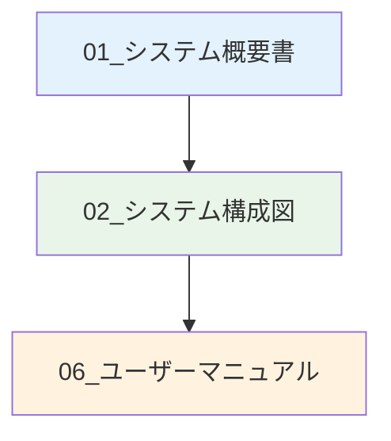
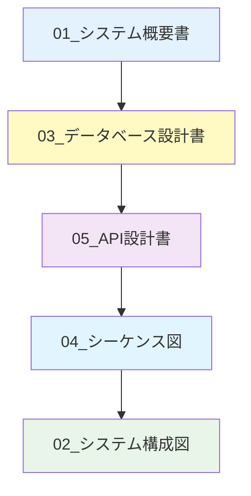
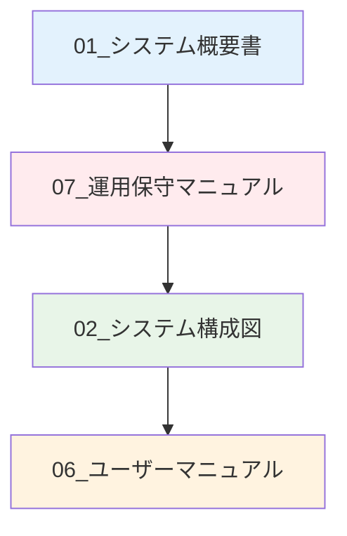
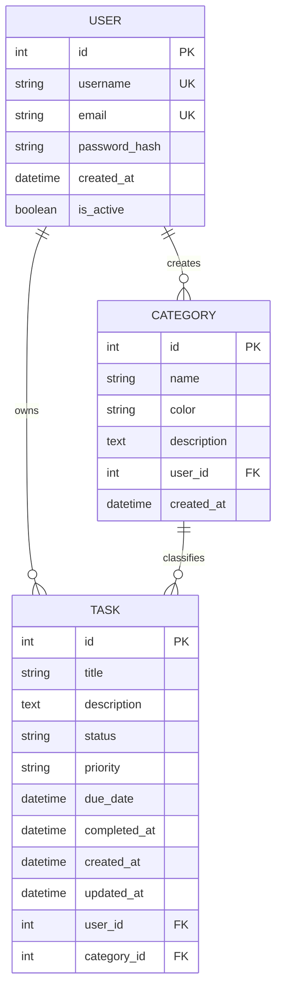

# 📚 タスク管理システム - ドキュメント一覧

## システム概要

Personal Task Managerは、個人のタスク管理を効率化するWebベースのアプリケーションです。Flask + SQLite + Pure JavaScriptで構築されており、シンプルで使いやすいインターフェースを提供します。

---

## 📋 ドキュメント一覧

### 🏗️ システム設計ドキュメント

| No. | ドキュメント名 | 内容 | 対象読者 |
|-----|----------------|------|----------|
| 01 | [システム概要書](01_システム概要書.md) | システムの目的、機能、技術スタック | 全員 |
| 02 | [システム構成図](02_システム構成図.md) | アーキテクチャ、コンポーネント関係 | 開発者・設計者 |
| 03 | [データベース設計書](03_データベース設計書.md) | DB設計、ER図、テーブル仕様 | 開発者・DBA |
| 04 | [シーケンス図](04_シーケンス図.md) | 主要な処理フローの詳細 | 開発者・設計者 |
| 05 | [API設計書](05_API設計書.md) | RESTful API仕様、エンドポイント | 開発者・テスター |

### 👥 利用者向けドキュメント

| No. | ドキュメント名 | 内容 | 対象読者 |
|-----|----------------|------|----------|
| 06 | [ユーザーマニュアル](06_ユーザーマニュアル.md) | 操作方法、使い方ガイド | エンドユーザー |
| 07 | [運用保守マニュアル](07_運用保守マニュアル.md) | 運用手順、障害対応 | 運用者・管理者 |

---

## 🎯 ドキュメントの用途別ガイド

### 初めてシステムを理解したい方



**推奨読書順序**:
1. **システム概要書** - 全体像の把握
2. **システム構成図** - 技術構成の理解
3. **ユーザーマニュアル** - 実際の使用方法

### 開発に参加したい方



**推奨読書順序**:
1. **システム概要書** - プロジェクトの理解
2. **データベース設計書** - データ構造の把握
3. **API設計書** - インターフェース仕様
4. **シーケンス図** - 処理フローの詳細
5. **システム構成図** - 技術アーキテクチャ

### システム運用を担当する方



**推奨読書順序**:
1. **システム概要書** - システムの基本理解
2. **運用保守マニュアル** - 運用手順の習得
3. **システム構成図** - 技術基盤の理解
4. **ユーザーマニュアル** - ユーザーサポート用

---

## 🔧 技術仕様サマリー

### システム構成
- **Backend**: Flask 3.0.0 + SQLAlchemy + SQLite
- **Frontend**: Pure JavaScript SPA + CSS3
- **認証**: JWT (Flask-JWT-Extended)
- **API**: RESTful API design

### データモデル


---

## 🚀 クイックスタート

システムをすぐに試したい方は以下の手順をお試しください：

### 1. システム起動
```bash
# 自動起動スクリプト実行
./start_app.sh
```

### 2. アクセス
- **フロントエンド**: http://localhost:8080
- **API**: http://localhost:5000/api

### 3. デモアカウントでログイン
- **ユーザー名**: `demo_user`
- **パスワード**: `demo_password`

### 4. 基本操作を試す
1. ダッシュボードで統計確認
2. 新しいタスクを作成
3. カテゴリを作成してタスクに割り当て
4. タスクのステータスを更新

---

## 📖 ドキュメント更新履歴

| 日付 | バージョン | 更新内容 | 更新者 |
|------|------------|----------|--------|
| 2024-12-27 | 1.0 | 初版作成（全ドキュメント） | Background Agent |

---

## 🤝 貢献・フィードバック

### ドキュメント改善
- 不明な点や改善提案がございましたら、issueを作成してください
- ドキュメントの誤字・脱字も歓迎します
- 新機能に関するドキュメント追加も受け付けています

### システム開発への参加
- 開発に参加される場合は、**API設計書**と**データベース設計書**から読み始めることをお勧めします
- テストコードの実装も歓迎します

---

## 📞 サポート情報

- **技術的な質問**: システム管理者まで
- **機能要望**: GitHub issueまで
- **バグ報告**: 詳細情報とともにissue作成

---

## 🔗 関連リンク

- [プロジェクトリポジトリ](#)
- [APIリファレンス](05_API設計書.md)
- [開発環境構築ガイド](07_運用保守マニュアル.md#2-環境構築デプロイ)

---

**📝 ドキュメント作成日**: 2024年12月27日  
**📋 システムバージョン**: 1.0  
**🔄 最終更新**: 2024年12月27日